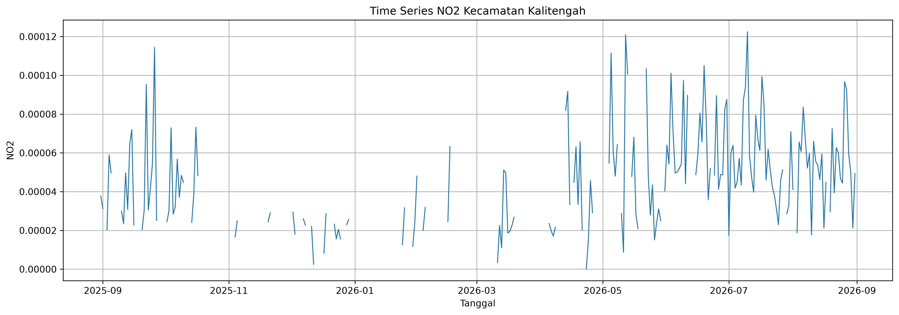
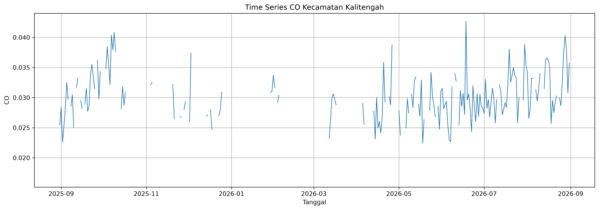
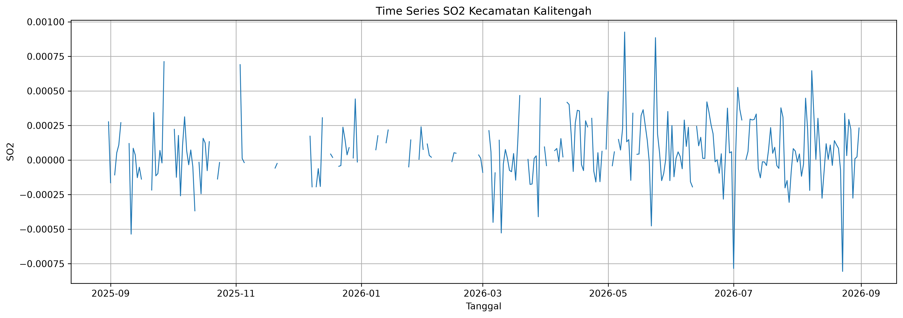

# 5. Eksplorasi Data

Pada tahap ini dilakukan eksplorasi terhadap dataset polutan udara Kecamatan Kalitengah, Kabupaten Lamongan. Tahap eksplorasi data bertujuan untuk memahami karakteristik dataset sebelum dilakukan proses preprocessing dan analisis lebih lanjut.

Eksplorasi dilakukan terhadap variabel waktu dan tiga parameter polutan, yaitu **NO₂ (Nitrogen Dioksida), CO (Karbon Monoksida), dan SO₂ (Sulfur Dioksida)**. Beberapa aspek yang diperiksa meliputi ukuran dataset, struktur dan tipe data, periode pengamatan, kelengkapan data, duplikasi, statistik deskriptif, nilai minimum dan maksimum, nilai ekstrem, nilai negatif, serta pola perubahan konsentrasi polutan berdasarkan waktu.

Analisis dilakukan menggunakan bahasa pemrograman Python dengan bantuan library **Pandas, NumPy, dan Matplotlib**.

---

## 5.1 Import Library

Library yang digunakan dalam tahap eksplorasi adalah Pandas, NumPy, dan Matplotlib. Pandas digunakan untuk membaca dan mengolah dataset, NumPy digunakan untuk operasi numerik, sedangkan Matplotlib digunakan untuk menghasilkan visualisasi data.

```python
import pandas as pd
import numpy as np
import matplotlib.pyplot as plt
```

---

## 5.2 Membaca Dataset

Dataset polutan Kecamatan Kalitengah disimpan dalam format CSV. Dataset kemudian dibaca menggunakan fungsi `read_csv()` dari library Pandas.

```python
df = pd.read_csv("../data/polutan_kalitengah_timeseries.csv")

df.head()
```

Perintah `df.head()` digunakan untuk melihat lima baris pertama dataset sekaligus memastikan struktur awal data dapat dibaca dengan baik.

Berdasarkan pemeriksaan awal, dataset memiliki empat variabel utama, yaitu:

| Variabel | Keterangan                    |
| -------- | ----------------------------- |
| `date`   | Tanggal pengamatan            |
| `NO2`    | Konsentrasi nitrogen dioksida |
| `CO`     | Konsentrasi karbon monoksida  |
| `SO2`    | Konsentrasi sulfur dioksida   |

Dataset menggunakan format satu baris untuk setiap tanggal pengamatan.

---

## 5.3 Ukuran Dataset

Ukuran dataset diperiksa untuk mengetahui jumlah baris dan kolom yang tersedia.

```python
print("Jumlah baris :", df.shape[0])
print("Jumlah kolom :", df.shape[1])
```

Hasil pemeriksaan:

```text
Jumlah baris : 366
Jumlah kolom : 4
```

Berdasarkan hasil tersebut, dataset terdiri dari **366 baris dan 4 kolom**. Jumlah 366 baris menunjukkan bahwa dataset mencakup satu tahun pengamatan dengan memperhitungkan keberadaan tanggal 29 Februari 2026.

Dengan demikian, setiap baris merepresentasikan satu tanggal pengamatan, sedangkan kolom berisi informasi tanggal dan nilai konsentrasi tiga polutan.

---

## 5.4 Informasi Struktur Dataset

Informasi struktur dataset diperiksa menggunakan fungsi `info()`.

```python
df.info()
```

Pemeriksaan ini digunakan untuk mengetahui:

* nama variabel;
* jumlah data non-null;
* tipe data setiap variabel;
* penggunaan memori dataset.

Pada kondisi awal, kolom `date` masih terbaca sebagai tipe data `object`, sedangkan variabel NO₂, CO, dan SO₂ terbaca sebagai tipe data numerik `float64`.

Tipe data tersebut perlu diperiksa dan disesuaikan, terutama pada variabel waktu, karena kolom `date` akan digunakan sebagai dasar analisis time series.

---

## 5.5 Konversi Variabel Waktu

Kolom `date` dikonversi dari tipe data `object` menjadi `datetime`.

```python
df["date"] = pd.to_datetime(df["date"])

df.dtypes
```

Konversi ini diperlukan agar data tanggal dapat digunakan untuk berbagai operasi analisis time series, seperti mencari tanggal awal dan akhir, mengurutkan data berdasarkan waktu, melakukan agregasi bulanan, serta membuat visualisasi perubahan polutan dari waktu ke waktu.

---

## 5.5.1 Pemeriksaan Periode Pengamatan

Setelah dikonversi menjadi tipe `datetime`, periode pengamatan diperiksa menggunakan nilai minimum dan maksimum tanggal.

```python
print("Tanggal awal :", df["date"].min())
print("Tanggal akhir:", df["date"].max())
```

Hasil:

```text
Tanggal awal : 2025-08-31
Tanggal akhir: 2026-08-31
```

Dengan demikian, periode pengamatan berlangsung selama **31 Agustus 2025 sampai 31 Agustus 2026**.

Selain memeriksa tanggal awal dan akhir, jumlah tanggal unik juga diperiksa untuk memastikan tidak terdapat tanggal yang hilang dari urutan kalender.

```python
print("Jumlah tanggal unik:", df["date"].nunique())
```

Hasil:

```text
Jumlah tanggal unik: 366
```

Jumlah tanggal unik sama dengan jumlah baris dataset, yaitu 366. Hal ini menunjukkan bahwa setiap baris memiliki tanggal yang berbeda.

---

## 5.5.2 Pemeriksaan Urutan Waktu

Karena dataset merupakan data time series, urutan waktu perlu diperiksa agar analisis tidak dilakukan terhadap data yang tersusun secara acak.

```python
df = df.sort_values("date").reset_index(drop=True)

print(df["date"].is_monotonic_increasing)
```

Jika menghasilkan:

```text
True
```

maka data telah tersusun secara kronologis dari tanggal paling awal sampai tanggal paling akhir.

---

# 5.6 Pemeriksaan Duplikasi

Pemeriksaan duplikasi dilakukan pada tingkat baris maupun tanggal.

```python
print("Jumlah baris duplikat   :", df.duplicated().sum())
print("Jumlah tanggal duplikat:", df["date"].duplicated().sum())
```

Hasil pemeriksaan terhadap dataset menunjukkan:

```text
Jumlah baris duplikat   : 0
Jumlah tanggal duplikat: 0
```

Hasil tersebut menunjukkan bahwa tidak terdapat baris duplikat maupun tanggal pengamatan yang tercatat lebih dari satu kali.

Kondisi ini merupakan hal yang baik karena setiap tanggal pengamatan hanya memiliki satu baris data sehingga tidak terdapat pengamatan ganda yang dapat memengaruhi analisis statistik maupun time series.

---

# 5.7 Pemeriksaan Kelengkapan Data

Sebelum melakukan analisis statistik, jumlah data yang tersedia pada setiap variabel perlu diperiksa.

```python
df[["NO2", "CO", "SO2"]].count()
```

Hasil:

| Polutan | Data Valid |
| ------- | ---------: |
| NO₂     |        218 |
| CO      |        209 |
| SO₂     |        262 |

Dari total 366 tanggal pengamatan, jumlah data valid untuk masing-masing polutan berbeda. SO₂ memiliki jumlah data valid paling banyak, sedangkan CO memiliki jumlah data valid paling sedikit.

Perbedaan jumlah data valid menunjukkan bahwa ketiga variabel memiliki tingkat kelengkapan data yang berbeda.

---

# 5.8 Analisis Missing Value

Missing value merupakan kondisi ketika suatu tanggal tidak memiliki nilai pengamatan pada variabel tertentu.

Jumlah missing value diperiksa menggunakan kode berikut:

```python
missing = df[["NO2", "CO", "SO2"]].isnull().sum()

missing
```

Hasil:

| Polutan | Missing Value |
| ------- | ------------: |
| NO₂     |           148 |
| CO      |           157 |
| SO₂     |           104 |

Persentase missing value kemudian dihitung sebagai berikut:

```python
missing_percentage = (
    df[["NO2", "CO", "SO2"]]
    .isnull()
    .mean()
    .mul(100)
    .round(2)
)

missing_percentage
```

Hasil:

| Polutan | Persentase Missing |
| ------- | -----------------: |
| NO₂     |             40,44% |
| CO      |             42,90% |
| SO₂     |             28,42% |

Berdasarkan hasil tersebut, **CO memiliki tingkat missing value tertinggi**, yaitu 42,90%. Selanjutnya NO₂ memiliki missing value sebesar 40,44%, sedangkan SO₂ memiliki missing value paling rendah sebesar 28,42%.

Temuan ini menunjukkan bahwa dataset memiliki tingkat kehilangan data yang cukup besar. Oleh karena itu, missing value menjadi salah satu permasalahan utama yang perlu dipertimbangkan pada tahap preprocessing.

---

## 5.8.1 Visualisasi Missing Value

Untuk memperjelas perbandingan jumlah missing value, data divisualisasikan menggunakan diagram batang.

```python
missing.plot(
    kind="bar",
    figsize=(8, 5)
)

plt.title("Jumlah Missing Value Setiap Polutan")
plt.xlabel("Polutan")
plt.ylabel("Jumlah Missing Value")
plt.xticks(rotation=0)
plt.tight_layout()
plt.show()
```

Visualisasi tersebut memperlihatkan bahwa jumlah missing value CO merupakan yang paling tinggi, diikuti oleh NO₂ dan SO₂.

Tingginya missing value perlu diperhatikan karena metode penanganan yang dipilih dapat memengaruhi karakteristik data dan hasil analisis berikutnya.

---

# 5.9 Statistik Deskriptif

Statistik deskriptif digunakan untuk memperoleh gambaran umum mengenai distribusi nilai NO₂, CO, dan SO₂.

```python
df[["NO2", "CO", "SO2"]].describe()
```

Berdasarkan dataset, diperoleh statistik sebagai berikut:

| Statistik |        NO₂ |       CO |         SO₂ |
| --------- | ---------: | -------: | ----------: |
| Count     |        218 |      209 |         262 |
| Mean      | 0,00004497 | 0,029909 |  0,00005736 |
| Std       | 0,00002479 | 0,004086 |  0,00023248 |
| Minimum   | 0,00000017 | 0,016442 | -0,00080622 |
| Q1        | 0,00002444 | 0,027155 | -0,00006275 |
| Median    | 0,00004283 | 0,029526 |  0,00004324 |
| Q3        | 0,00005938 | 0,032214 |  0,00018375 |
| Maximum   | 0,00012250 | 0,042702 |  0,00092589 |

Nilai rata-rata NO₂ adalah sekitar **0,00004497**, sedangkan nilai median berada pada sekitar **0,00004283**. Kedekatan antara rata-rata dan median menunjukkan bahwa nilai pusat distribusi NO₂ relatif berdekatan.

Untuk CO, nilai rata-rata sebesar **0,029909** dan median sebesar **0,029526** juga menunjukkan posisi pusat distribusi yang relatif berdekatan.

Sementara itu, SO₂ memiliki standar deviasi yang relatif besar dibandingkan rata-ratanya. Kondisi tersebut berkaitan dengan adanya variasi nilai SO₂ yang cukup besar, termasuk keberadaan nilai negatif dan nilai positif yang relatif tinggi.

---

# 5.10 Analisis Kuartil dan Sebaran Data

Untuk melihat sebaran data secara lebih rinci, nilai kuartil dapat diperiksa menggunakan fungsi `quantile()`.

```python
df[["NO2", "CO", "SO2"]].quantile(
    [0.01, 0.05, 0.25, 0.50, 0.75, 0.95, 0.99]
)
```

Analisis kuartil dapat digunakan untuk mengetahui bagaimana data tersebar pada bagian bawah, tengah, dan atas distribusi.

Untuk NO₂, 50% data berada pada rentang antara sekitar **0,00002444 hingga 0,00005938**. Nilai median berada pada sekitar **0,00004283**.

Untuk CO, 50% data berada pada rentang sekitar **0,027155 hingga 0,032214**, dengan median sekitar **0,029526**.

Pada SO₂, nilai kuartil pertama berada pada nilai negatif, sedangkan median berada pada nilai positif. Hal ini menunjukkan bahwa distribusi SO₂ mencakup nilai negatif maupun positif dan perlu diperiksa lebih lanjut pada tahap validasi data.

---

# 5.11 Analisis Nilai Minimum dan Maksimum

Nilai minimum dan maksimum digunakan untuk mengetahui rentang nilai yang terdapat pada setiap variabel polutan.

```python
summary_min_max = pd.DataFrame({
    "Minimum": df[["NO2", "CO", "SO2"]].min(),
    "Maksimum": df[["NO2", "CO", "SO2"]].max()
})

summary_min_max
```

Hasil:

| Polutan |     Minimum |   Maksimum |
| ------- | ----------: | ---------: |
| NO₂     |  0,00000017 | 0,00012250 |
| CO      |  0,01644243 | 0,04270215 |
| SO₂     | -0,00080622 | 0,00092589 |

NO₂ memiliki nilai maksimum sebesar **0,00012250**, sedangkan CO memiliki nilai maksimum sebesar **0,04270215**. Pada SO₂, nilai minimum mencapai **-0,00080622** dan nilai maksimum mencapai **0,00092589**.

Rentang tersebut menunjukkan bahwa karakteristik skala ketiga variabel berbeda sehingga interpretasi masing-masing variabel perlu dilakukan sesuai karakteristik dan satuannya.

---

# 5.12 Identifikasi Nilai Tertinggi

Selain mengetahui nilai maksimum, penting untuk mengetahui tanggal terjadinya nilai maksimum masing-masing polutan.

```python
for pollutant in ["NO2", "CO", "SO2"]:
    idx = df[pollutant].idxmax()

    print(f"{pollutant}")
    print("Tanggal :", df.loc[idx, "date"].date())
    print("Nilai   :", df.loc[idx, pollutant])
    print()
```

Berdasarkan dataset diperoleh:

| Polutan | Tanggal Nilai Tertinggi |      Nilai |
| ------- | ----------------------- | ---------: |
| NO₂     | 10 Juli 2026            | 0,00012250 |
| CO      | 18 Juni 2026            | 0,04270215 |
| SO₂     | 9 Mei 2026              | 0,00092589 |

Informasi tanggal nilai maksimum penting dalam analisis time series karena memungkinkan nilai ekstrem dikaitkan dengan periode tertentu dalam rentang pengamatan.

Namun, keberadaan nilai maksimum tidak secara langsung menunjukkan bahwa data tersebut merupakan kesalahan. Nilai tersebut perlu diperiksa berdasarkan distribusi data dan konteks pengukuran.

---

# 5.13 Identifikasi Nilai Terendah

Pemeriksaan juga dilakukan terhadap nilai minimum masing-masing polutan.

```python
for pollutant in ["NO2", "CO", "SO2"]:
    idx = df[pollutant].idxmin()

    print(f"{pollutant}")
    print("Tanggal :", df.loc[idx, "date"].date())
    print("Nilai   :", df.loc[idx, pollutant])
    print()
```

Hasil:

| Polutan | Tanggal Nilai Terendah |       Nilai |
| ------- | ---------------------- | ----------: |
| NO₂     | 23 April 2026          |  0,00000017 |
| CO      | 19 Maret 2026          |  0,01644243 |
| SO₂     | 23 Agustus 2026        | -0,00080622 |

Pada NO₂ dan CO, nilai minimum masih berada pada nilai positif. Berbeda dengan keduanya, SO₂ memiliki nilai minimum negatif.

---

# 5.14 Pemeriksaan Nilai Negatif

Pemeriksaan nilai negatif dilakukan untuk mengetahui apakah terdapat nilai konsentrasi polutan yang berada di bawah nol.

```python
negative_values = {}

for pollutant in ["NO2", "CO", "SO2"]:
    negative_values[pollutant] = (df[pollutant] < 0).sum()

pd.Series(negative_values)
```

Hasil pemeriksaan:

| Polutan | Jumlah Nilai Negatif |
| ------- | -------------------: |
| NO₂     |                    0 |
| CO      |                    0 |
| SO₂     |                   99 |

Dengan demikian, terdapat **99 nilai negatif pada SO₂**, sedangkan NO₂ dan CO tidak memiliki nilai negatif.

Secara interpretasi fisik, konsentrasi polutan umumnya tidak diharapkan bernilai negatif. Oleh karena itu, keberadaan 99 nilai negatif pada SO₂ perlu mendapatkan perhatian khusus.

Meskipun demikian, nilai tersebut tidak langsung dihapus pada tahap eksplorasi. Nilai negatif dipertahankan terlebih dahulu untuk menjaga informasi dataset asli. Penanganannya akan ditentukan pada tahap preprocessing setelah dilakukan pemeriksaan lebih lanjut terhadap sumber data dan karakteristik pengukuran.

---

# 5.15 Pemeriksaan Outlier

Selain nilai negatif, pemeriksaan terhadap outlier juga penting dilakukan. Outlier merupakan nilai yang memiliki jarak relatif jauh dari sebagian besar data.

Salah satu metode sederhana untuk mengidentifikasi outlier adalah menggunakan **Interquartile Range (IQR)**.

Rumus IQR adalah:

$$
IQR = Q_3 - Q_1
$$

Batas bawah dan batas atas dapat dihitung menggunakan:

$$
Lower\ Bound = Q_1 - 1.5(IQR)
$$

$$
Upper\ Bound = Q_3 + 1.5(IQR)
$$

Implementasi menggunakan Python:

```python
outlier_summary = {}

for pollutant in ["NO2", "CO", "SO2"]:
    q1 = df[pollutant].quantile(0.25)
    q3 = df[pollutant].quantile(0.75)

    iqr = q3 - q1

    lower = q1 - 1.5 * iqr
    upper = q3 + 1.5 * iqr

    outliers = df[
        (df[pollutant] < lower) |
        (df[pollutant] > upper)
    ][pollutant]

    outlier_summary[pollutant] = {
        "Q1": q1,
        "Q3": q3,
        "IQR": iqr,
        "Lower Bound": lower,
        "Upper Bound": upper,
        "Jumlah Outlier": len(outliers)
    }

outlier_summary = pd.DataFrame(outlier_summary).T

outlier_summary
```

Pemeriksaan outlier ini digunakan sebagai analisis tambahan untuk membedakan antara variasi nilai yang masih berada dalam distribusi data dan nilai yang memiliki posisi ekstrem.

Nilai yang teridentifikasi sebagai outlier tidak secara otomatis dianggap sebagai kesalahan. Pada data lingkungan, nilai ekstrem dapat mencerminkan kondisi tertentu sehingga perlu diperiksa lebih lanjut sebelum dilakukan penghapusan atau transformasi.

---

# 5.16 Analisis Pola Data Berdasarkan Waktu

Karena dataset memiliki struktur time series, selain statistik keseluruhan, perubahan data berdasarkan waktu juga perlu diperiksa.

Data dapat dikelompokkan berdasarkan bulan untuk melihat jumlah pengamatan dan rata-rata nilai setiap polutan.

```python
df["month"] = df["date"].dt.to_period("M")

monthly_summary = df.groupby("month")[["NO2", "CO", "SO2"]].agg(
    ["count", "mean", "min", "max"]
)

monthly_summary
```

Analisis bulanan dapat membantu mengetahui perubahan karakteristik polutan sepanjang periode pengamatan.

Berdasarkan dataset, jumlah data valid setiap bulan tidak selalu sama. Hal tersebut menunjukkan bahwa missing value tidak tersebar secara merata sepanjang periode pengamatan.

Kondisi tersebut perlu diperhatikan karena pola missing value berdasarkan waktu dapat memengaruhi metode interpolasi maupun metode imputasi yang akan digunakan.

---

# 5.17 Visualisasi Time Series

Visualisasi time series digunakan untuk melihat perubahan konsentrasi NO₂, CO, dan SO₂ dari tanggal ke tanggal selama periode pengamatan.

Pada proses visualisasi, nilai `NaN` tidak diubah menjadi nol. Matplotlib akan menampilkan bagian tersebut sebagai gap pada grafik. Pendekatan ini digunakan agar missing value tidak disalahartikan sebagai konsentrasi polutan bernilai nol.

---

## 5.17.1 Konsentrasi NO₂

```python
plt.figure(figsize=(12, 5))

plt.plot(
    df["date"],
    df["NO2"],
    marker=".",
    linewidth=1
)

plt.title("Time Series NO₂ Kecamatan Kalitengah")
plt.xlabel("Tanggal")
plt.ylabel("NO₂")
plt.grid(True, alpha=0.3)
plt.tight_layout()
plt.show()
```



Grafik NO₂ digunakan untuk melihat perubahan konsentrasi dari waktu ke waktu. Berdasarkan statistik dataset, konsentrasi NO₂ memiliki nilai rata-rata sekitar **0,00004497** dengan nilai minimum **0,00000017** dan maksimum **0,00012250**.

Gap pada grafik menunjukkan tanggal ketika tidak terdapat data NO₂.

---

## 5.17.2 Konsentrasi CO

```python
plt.figure(figsize=(12, 5))

plt.plot(
    df["date"],
    df["CO"],
    marker=".",
    linewidth=1
)

plt.title("Time Series CO Kecamatan Kalitengah")
plt.xlabel("Tanggal")
plt.ylabel("CO")
plt.grid(True, alpha=0.3)
plt.tight_layout()
plt.show()
```



Grafik CO menunjukkan perubahan konsentrasi karbon monoksida selama periode pengamatan.

Berdasarkan hasil statistik deskriptif, CO memiliki nilai rata-rata sekitar **0,029909**, nilai minimum **0,01644243**, dan nilai maksimum **0,04270215**.

CO juga memiliki persentase missing value paling tinggi dibandingkan dua variabel lainnya, yaitu **42,90%**. Kondisi tersebut dapat terlihat dalam bentuk gap pada grafik time series.

---

## 5.17.3 Konsentrasi SO₂

```python
plt.figure(figsize=(12, 5))

plt.plot(
    df["date"],
    df["SO2"],
    marker=".",
    linewidth=1
)

plt.title("Time Series SO₂ Kecamatan Kalitengah")
plt.xlabel("Tanggal")
plt.ylabel("SO₂")
plt.grid(True, alpha=0.3)
plt.tight_layout()
plt.show()
```



Grafik SO₂ digunakan untuk mengamati perubahan nilai sulfur dioksida selama periode pengamatan.

Berbeda dengan NO₂ dan CO, data SO₂ memiliki nilai negatif. Nilai minimum SO₂ mencapai **-0,00080622**, sedangkan nilai maksimumnya mencapai **0,00092589**.

Selain itu, terdapat **99 nilai negatif** pada SO₂. Kondisi tersebut menjadi salah satu temuan penting dari tahap eksplorasi dan perlu diperhatikan dalam proses preprocessing.

---

# 5.18 Perbandingan Jumlah Data Valid

Untuk memberikan gambaran yang lebih jelas mengenai kelengkapan data, jumlah data valid masing-masing polutan dapat divisualisasikan.

```python
valid = df[["NO2", "CO", "SO2"]].notnull().sum()

valid.plot(
    kind="bar",
    figsize=(8, 5)
)

plt.title("Jumlah Data Valid Setiap Polutan")
plt.xlabel("Polutan")
plt.ylabel("Jumlah Data Valid")
plt.xticks(rotation=0)
plt.tight_layout()
plt.show()
```

Berdasarkan hasil perhitungan, SO₂ memiliki data valid paling banyak, yaitu **262 data**, sedangkan CO memiliki data valid paling sedikit, yaitu **209 data**.

Visualisasi ini memberikan gambaran bahwa kualitas kelengkapan data berbeda antarvariabel.

---

# 5.19 Ringkasan Hasil Eksplorasi

Hasil eksplorasi dataset dapat dirangkum sebagai berikut:

| Aspek               | Hasil           |
| ------------------- | --------------- |
| Jumlah baris        | 366             |
| Jumlah kolom        | 4               |
| Periode awal        | 31 Agustus 2025 |
| Periode akhir       | 31 Agustus 2026 |
| Jumlah tanggal unik | 366             |
| Duplikasi baris     | 0               |
| Duplikasi tanggal   | 0               |
| Data valid NO₂      | 218             |
| Data valid CO       | 209             |
| Data valid SO₂      | 262             |
| Missing NO₂         | 148 (40,44%)    |
| Missing CO          | 157 (42,90%)    |
| Missing SO₂         | 104 (28,42%)    |
| Nilai negatif NO₂   | 0               |
| Nilai negatif CO    | 0               |
| Nilai negatif SO₂   | 99              |

Berdasarkan ringkasan tersebut, dataset memiliki struktur waktu yang baik karena tidak ditemukan tanggal duplikat dan seluruh 366 tanggal merupakan tanggal unik. Namun, dari sisi kelengkapan data, dataset masih memiliki permasalahan missing value yang cukup tinggi.

---

# 5.20 Kesimpulan Eksplorasi Data

Berdasarkan hasil eksplorasi, dataset polutan Kecamatan Kalitengah terdiri dari **366 tanggal pengamatan dan empat variabel**, yaitu `date`, `NO2`, `CO`, dan `SO2`. Periode pengamatan berlangsung dari **31 Agustus 2025 sampai 31 Agustus 2026** dan seluruh tanggal dalam dataset bersifat unik sehingga tidak ditemukan duplikasi baris maupun tanggal.

Hasil pemeriksaan kelengkapan data menunjukkan bahwa jumlah data valid berbeda pada setiap variabel. NO₂ memiliki **218 data valid**, CO memiliki **209 data valid**, sedangkan SO₂ memiliki **262 data valid**. Dengan total 366 tanggal pengamatan, persentase missing value masing-masing mencapai **40,44% untuk NO₂, 42,90% untuk CO, dan 28,42% untuk SO₂**. Dengan demikian, missing value merupakan salah satu permasalahan utama yang perlu ditangani pada tahap preprocessing.

Dari sisi statistik deskriptif, NO₂ memiliki nilai rata-rata sekitar **0,00004497**, CO sekitar **0,029909**, dan SO₂ sekitar **0,00005736**. Nilai maksimum NO₂ tercatat sebesar **0,00012250 pada 10 Juli 2026**, sedangkan nilai maksimum CO sebesar **0,04270215 pada 18 Juni 2026** dan nilai maksimum SO₂ sebesar **0,00092589 pada 9 Mei 2026**.

Pemeriksaan kualitas data juga menemukan adanya **99 nilai negatif pada variabel SO₂**, sedangkan NO₂ dan CO tidak memiliki nilai negatif. Karena konsentrasi polutan secara umum tidak diharapkan bernilai negatif, temuan ini perlu diperiksa lebih lanjut. Nilai negatif tidak langsung dihapus pada tahap eksplorasi karena keputusan penanganannya perlu ditentukan berdasarkan proses validasi dan preprocessing.

Visualisasi time series menunjukkan bahwa ketersediaan data tidak merata sepanjang periode pengamatan. Missing value ditampilkan sebagai gap pada grafik dan tidak diubah menjadi nilai nol agar kondisi dataset asli tetap dapat diamati.

Secara keseluruhan, hasil eksplorasi menunjukkan bahwa dataset sudah memiliki struktur waktu yang konsisten dan tidak mengandung duplikasi, tetapi masih memiliki beberapa permasalahan kualitas data, terutama **missing value dalam jumlah besar dan nilai negatif pada SO₂**. Oleh karena itu, tahap berikutnya perlu difokuskan pada proses **preprocessing**, meliputi pemeriksaan lebih lanjut terhadap nilai negatif, penanganan missing value, identifikasi dan penanganan outlier, serta penyusunan dataset akhir yang siap digunakan untuk analisis berikutnya.
