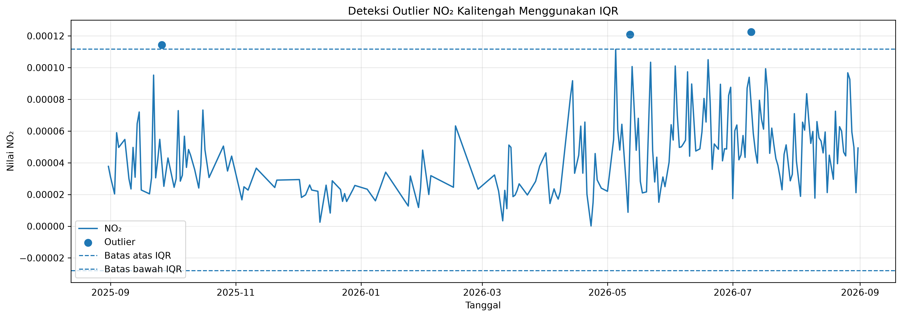
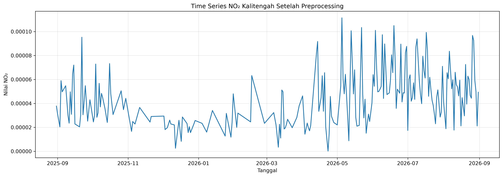

# Preprocessing dan Ekstraksi 68 Fitur TSFEL Data NO₂ Kalitengah

## 1. Pendahuluan

Data yang digunakan merupakan data deret waktu (time series) konsentrasi
nitrogen dioksida (NO₂) di Kecamatan Kalitengah, Kabupaten Lamongan.
Data memiliki periode pengamatan **31 Agustus 2025 sampai 31 Agustus
2026** dengan total **366 observasi harian**.

Data awal belum langsung digunakan untuk ekstraksi fitur karena masih
terdapat **missing value** dan beberapa nilai yang teridentifikasi
sebagai **outlier**. Oleh karena itu, dilakukan tahapan preprocessing
terlebih dahulu agar data menjadi lebih konsisten dan dapat digunakan
sebagai input pada proses ekstraksi fitur menggunakan **Time Series
Feature Extraction Library (TSFEL)**.

Alur utama pengolahan data adalah:

**Data awal → pemeriksaan missing value → deteksi outlier IQR → outlier
menjadi NaN → interpolasi berbasis waktu → forward fill → backward fill
→ data bersih → ekstraksi 68 fitur TSFEL → validasi hasil**

------------------------------------------------------------------------

## 2. Sumber dan Struktur Data

Dataset yang digunakan berupa data time series NO₂ dengan dua variabel
utama:

  Variabel   Tipe       Keterangan
  ---------- ---------- -----------------------
  `date`     DateTime   Tanggal pengamatan
  `NO2`      Numerik    Nilai konsentrasi NO₂

Kolom `date` digunakan sebagai indeks waktu, sedangkan kolom `NO2`
digunakan sebagai **sinyal time series** yang akan diproses dan
diekstraksi fiturnya.

Data pengamatan terdiri dari **366 data harian**, sehingga setiap nilai
NO₂ mewakili satu titik pengamatan pada waktu tertentu.

------------------------------------------------------------------------

## 3. Pemeriksaan dan Persiapan Data

Tahap awal dilakukan untuk memastikan format data sesuai dengan
kebutuhan analisis time series.

``` python
import pandas as pd
import numpy as np

df = pd.read_csv('NO2-Kalitengah.csv')

df['date'] = pd.to_datetime(df['date'])
df = df.sort_values('date').reset_index(drop=True)
df['NO2'] = pd.to_numeric(df['NO2'], errors='coerce')
```

Tahapan tersebut memiliki fungsi sebagai berikut:

1.  Membaca dataset menggunakan `pandas`.
2.  Mengubah kolom `date` menjadi format tanggal.
3.  Mengurutkan data berdasarkan waktu.
4.  Mengubah kolom `NO2` menjadi tipe numerik.
5.  Nilai yang tidak dapat dikonversi menjadi angka akan diubah menjadi
    `NaN`.

Langkah ini penting karena TSFEL membutuhkan sinyal numerik yang
tersusun berdasarkan urutan waktu.

------------------------------------------------------------------------

## 4. Pemeriksaan Missing Value

Setelah data dibaca dan formatnya disesuaikan, dilakukan pemeriksaan
terhadap nilai yang hilang.

Pada data awal ditemukan:

-   Jumlah observasi: **366**
-   Missing value NO₂: **148**
-   Data yang tersedia: **218**
-   Persentase missing value sekitar **40,44%**

Missing value tidak langsung dihapus karena data yang digunakan
merupakan **time series**. Menghapus baris dapat menyebabkan urutan
waktu menjadi tidak lengkap dan mengurangi informasi temporal yang
tersedia.

Oleh karena itu, missing value akan ditangani pada tahap preprocessing
menggunakan metode pengisian yang mempertimbangkan urutan waktu.

------------------------------------------------------------------------

## 5. Visualisasi Time Series Sebelum Preprocessing

Visualisasi pertama digunakan untuk melihat kondisi data NO₂ sebelum
dilakukan preprocessing.

**Gambar 1. Time Series NO₂ Kalitengah Sebelum Preprocessing**


Gambar menunjukkan kondisi data NO₂ sebelum preprocessing.

Grafik menunjukkan perubahan nilai NO₂ dari Agustus 2025 sampai Agustus
2026. Nilai NO₂ mengalami perubahan dari waktu ke waktu dengan beberapa
periode yang memiliki perubahan cukup besar.

Pada grafik juga dapat terlihat adanya bagian data yang tidak tersedia.
Kondisi tersebut sesuai dengan hasil pemeriksaan missing value yang
menunjukkan bahwa sebagian observasi NO₂ belum memiliki nilai.

Visualisasi awal digunakan sebagai gambaran kondisi data sebelum
dilakukan penanganan missing value dan outlier.

------------------------------------------------------------------------

## 6. Deteksi Outlier Menggunakan IQR

### 6.1 Pengertian Outlier

Outlier adalah nilai yang memiliki karakteristik berbeda secara cukup
jauh dibandingkan dengan sebagian besar data lainnya.

Dalam pengolahan data NO₂ Kalitengah, outlier dideteksi menggunakan
metode **Interquartile Range (IQR)**.

Metode IQR dipilih karena dapat mendeteksi nilai yang berada di luar
rentang distribusi utama data tanpa harus menghapus observasi secara
langsung.

### 6.2 Rumus IQR

Nilai IQR dihitung dengan:

``` text
IQR = Q3 - Q1
```

Kemudian ditentukan batas bawah dan batas atas:

``` text
Batas bawah = Q1 - 1.5 × IQR
Batas atas  = Q3 + 1.5 × IQR
```

Berdasarkan data NO₂ Kalitengah diperoleh:

``` text
Q1  = 2.44425 × 10⁻⁵
Q3  = 5.93775 × 10⁻⁵
IQR = 3.49350 × 10⁻⁵

Batas bawah = -2.79600 × 10⁻⁵
Batas atas  = 1.11780 × 10⁻⁴
```

Dengan demikian, nilai NO₂ yang lebih besar dari **0.00011178**
dikategorikan sebagai outlier berdasarkan aturan IQR.

------------------------------------------------------------------------

## 7. Hasil Deteksi Outlier

Berdasarkan perhitungan IQR, terdapat **3 nilai outlier** pada data NO₂.

    No Tanggal               Nilai NO₂
  ---- ------------------- -----------
     1 26 September 2025      0.000114
     2 12 Mei 2026            0.000121
     3 10 Juli 2026           0.000122

Ketiga nilai tersebut berada di atas batas atas IQR.

**Gambar 2. Deteksi Outlier NO₂ Kalitengah Menggunakan IQR**



Pada grafik, titik outlier ditampilkan secara terpisah dari garis time
series. Garis batas atas dan batas bawah IQR digunakan sebagai acuan
untuk melihat posisi nilai terhadap rentang yang diperbolehkan oleh
metode IQR.

Batas bawah bernilai negatif. Hal tersebut merupakan hasil matematis
dari rumus IQR dan tidak berarti bahwa terdapat nilai NO₂ negatif pada
data.

------------------------------------------------------------------------

## 8. Penanganan Outlier

Outlier tidak dihapus sebagai baris data. Nilai yang teridentifikasi
sebagai outlier diubah menjadi `NaN`.

``` python
df.loc[
    (df['NO2'] < lower_bound) |
    (df['NO2'] > upper_bound),
    'NO2'
] = np.nan
```

Pendekatan ini digunakan agar struktur tanggal tetap dipertahankan.
Setelah outlier diubah menjadi `NaN`, nilai tersebut akan ditangani
bersama dengan missing value pada tahap berikutnya.

Setelah penambahan 3 outlier sebagai missing value:

-   Missing value awal: **148**
-   Outlier: **3**
-   Total nilai yang perlu ditangani: **151**

Dengan demikian, preprocessing tidak menghilangkan tanggal pengamatan,
tetapi memperbaiki nilai NO₂ yang dianggap tidak sesuai dengan rentang
data berdasarkan metode IQR.

------------------------------------------------------------------------

## 9. Interpolasi Data Time Series

Setelah outlier diubah menjadi `NaN`, dilakukan interpolasi berdasarkan
waktu.

``` python
df_clean = (
    df.set_index('date')
      .interpolate(method='time')
      .ffill()
      .bfill()
)
```

### 9.1 Interpolasi Berbasis Waktu

`interpolate(method='time')` digunakan untuk memperkirakan nilai yang
hilang berdasarkan informasi waktu dan nilai di sekitar titik yang
kosong.

Metode ini sesuai untuk data time series karena pengisian tidak hanya
melihat posisi baris, tetapi mempertimbangkan indeks waktu.

### 9.2 Forward Fill

Setelah interpolasi, digunakan:

``` python
.ffill()
```

Forward fill mengisi nilai yang masih kosong menggunakan nilai valid
sebelumnya.

Metode ini membantu menangani nilai kosong yang belum dapat diisi
melalui interpolasi, terutama pada bagian data yang memiliki kekosongan
di dekat batas tertentu.

### 9.3 Backward Fill

Selanjutnya digunakan:

``` python
.bfill()
```

Backward fill mengisi nilai yang masih kosong menggunakan nilai valid
setelahnya.

Kombinasi interpolasi, forward fill, dan backward fill digunakan untuk
memastikan seluruh data NO₂ dapat digunakan pada tahap ekstraksi fitur.

------------------------------------------------------------------------

## 10. Hasil Preprocessing

Setelah seluruh proses preprocessing selesai, dilakukan pemeriksaan
kembali terhadap missing value.

Hasil akhir:

  Tahap                                    Jumlah
  ------------------------------------- ---------
  Data awal                                   366
  Missing value awal                          148
  Outlier IQR                                   3
  Missing/outlier setelah deteksi             151
  Missing value setelah preprocessing       **0**
  Data akhir                              **366**

Dengan demikian, jumlah observasi tetap **366 data**, tetapi seluruh
nilai NO₂ telah tersedia.

**Gambar 3. Time Series NO₂ Kalitengah Setelah Preprocessing**



Grafik setelah preprocessing menunjukkan bahwa deret waktu NO₂ sudah
kontinu. Nilai yang sebelumnya kosong maupun nilai yang dianggap outlier
telah ditangani melalui proses pengisian nilai.

Perlu diperhatikan bahwa preprocessing tidak dimaksudkan untuk
menghilangkan perubahan alami pada data. Nilai-nilai yang masih
menunjukkan kenaikan atau penurunan tetap dipertahankan selama tidak
termasuk outlier berdasarkan aturan yang digunakan.

------------------------------------------------------------------------

## 11. Alur Preprocessing

Secara keseluruhan, proses preprocessing dapat diringkas sebagai
berikut:

``` text
┌──────────────────────────────┐
│ Data NO₂ Kalitengah          │
│ 366 observasi harian         │
└──────────────┬───────────────┘
               │
               ▼
┌──────────────────────────────┐
│ Pemeriksaan Missing Value    │
│ 148 missing value            │
└──────────────┬───────────────┘
               │
               ▼
┌──────────────────────────────┐
│ Deteksi Outlier IQR          │
│ Ditemukan 3 outlier          │
└──────────────┬───────────────┘
               │
               ▼
┌──────────────────────────────┐
│ Outlier → NaN                │
│ Total perlu ditangani = 151  │
└──────────────┬───────────────┘
               │
               ▼
┌──────────────────────────────┐
│ Interpolasi Berbasis Waktu   │
└──────────────┬───────────────┘
               │
               ▼
┌──────────────────────────────┐
│ Forward Fill + Backward Fill │
└──────────────┬───────────────┘
               │
               ▼
┌──────────────────────────────┐
│ Data NO₂ Bersih              │
│ 366 data, 0 missing value    │
└──────────────────────────────┘
```

------------------------------------------------------------------------

# 12. Ekstraksi Fitur Menggunakan TSFEL

## 12.1 Pengertian TSFEL

**Time Series Feature Extraction Library (TSFEL)** merupakan library
yang digunakan untuk melakukan ekstraksi fitur dari data time series.

Pada penelitian/pengolahan ini, data yang digunakan sebagai input TSFEL
adalah **366 nilai NO₂ yang telah melalui preprocessing**.

Tujuan ekstraksi fitur adalah mengubah sinyal time series yang memiliki
banyak observasi menjadi sekumpulan nilai numerik yang mewakili
karakteristik tertentu dari sinyal.

Pada tahap ini digunakan **68 fitur TSFEL**.

Konsep prosesnya:

``` text
366 nilai NO₂ bersih
        ↓
      TSFEL
        ↓
68 fungsi/fitur
        ↓
68 nilai fitur
```

Sampling frequency yang digunakan adalah:

``` python
fs = 1
```

Karena data merupakan observasi harian dan satu titik data mewakili satu
observasi dalam urutan time series yang digunakan pada proses ekstraksi.

------------------------------------------------------------------------

# 13. Daftar 68 Fitur TSFEL

Fitur yang digunakan terdiri dari fitur statistik, temporal,
kompleksitas, spektral, dan wavelet.

    No Fitur
  ---- -------------------------------
     1 `abs_energy`
     2 `auc`
     3 `autocorr`
     4 `average_power`
     5 `calc_centroid`
     6 `calc_max`
     7 `calc_mean`
     8 `calc_median`
     9 `calc_min`
    10 `calc_std`
    11 `calc_var`
    12 `dfa`
    13 `distance`
    14 `ecdf`
    15 `ecdf_percentile`
    16 `ecdf_percentile_count`
    17 `ecdf_slope`
    18 `entropy`
    19 `fundamental_frequency`
    20 `higuchi_fractal_dimension`
    21 `hist_mode`
    22 `human_range_energy`
    23 `hurst_exponent`
    24 `interq_range`
    25 `kurtosis`
    26 `lempel_ziv`
    27 `lpcc`
    28 `max_frequency`
    29 `max_power_spectrum`
    30 `maximum_fractal_length`
    31 `mean_abs_deviation`
    32 `mean_abs_diff`
    33 `mean_diff`
    34 `median_abs_deviation`
    35 `median_abs_diff`
    36 `median_diff`
    37 `median_frequency`
    38 `mfcc`
    39 `mse`
    40 `negative_turning`
    41 `neighbourhood_peaks`
    42 `petrosian_fractal_dimension`
    43 `pk_pk_distance`
    44 `positive_turning`
    45 `power_bandwidth`
    46 `rms`
    47 `skewness`
    48 `slope`
    49 `spectral_centroid`
    50 `spectral_decrease`
    51 `spectral_distance`
    52 `spectral_entropy`
    53 `spectral_kurtosis`
    54 `spectral_positive_turning`
    55 `spectral_roll_off`
    56 `spectral_roll_on`
    57 `spectral_skewness`
    58 `spectral_slope`
    59 `spectral_spread`
    60 `spectral_variation`
    61 `spectrogram_mean_coeff`
    62 `sum_abs_diff`
    63 `wavelet_abs_mean`
    64 `wavelet_energy`
    65 `wavelet_entropy`
    66 `wavelet_std`
    67 `wavelet_var`
    68 `zero_cross`

------------------------------------------------------------------------

# 14. Penjelasan Kelompok Fitur

Agar lebih mudah dipahami, 68 fitur dapat dikelompokkan berdasarkan
karakteristik yang dianalisis.

## 14.1 Fitur Energi dan Statistik Dasar

Beberapa fitur digunakan untuk menggambarkan karakteristik umum nilai
NO₂.

### `abs_energy`

Menggambarkan total energi absolut dari sinyal.

### `average_power`

Menggambarkan rata-rata daya/energi sinyal.

### `calc_max`

Menunjukkan nilai maksimum pada sinyal.

### `calc_mean`

Menghasilkan nilai rata-rata NO₂.

### `calc_median`

Menunjukkan nilai tengah dari data.

### `calc_min`

Menunjukkan nilai minimum pada sinyal.

### `calc_std`

Mengukur standar deviasi atau tingkat penyebaran nilai terhadap
rata-rata.

### `calc_var`

Mengukur varians data.

### `interq_range`

Mengukur rentang interkuartil, yaitu selisih kuartil ketiga dan kuartil
pertama.

### `kurtosis`

Menggambarkan bentuk distribusi data berdasarkan tingkat keruncingan
atau ekor distribusi.

### `skewness`

Menggambarkan kemencengan distribusi nilai terhadap pusat distribusinya.

### `hist_mode`

Menunjukkan modus berdasarkan distribusi histogram.

### `mean_abs_deviation`

Mengukur rata-rata penyimpangan absolut nilai terhadap pusat data.

### `median_abs_deviation`

Mengukur penyimpangan absolut berdasarkan median.

### `mse`

Menghasilkan ukuran berbasis kesalahan kuadrat rata-rata sesuai definisi
fitur TSFEL.

### `rms`

Menghitung root mean square dari sinyal.

------------------------------------------------------------------------

## 14.2 Fitur Perubahan dan Perbedaan Nilai

Kelompok ini menggambarkan perubahan nilai NO₂ antarobservasi.

### `mean_abs_diff`

Mengukur rata-rata selisih absolut antar titik data.

### `mean_diff`

Menggambarkan rata-rata perubahan antarobservasi.

### `median_abs_diff`

Mengukur median dari selisih absolut.

### `median_diff`

Menggambarkan median perubahan antarobservasi.

### `sum_abs_diff`

Menghitung total selisih absolut pada sinyal.

### `pk_pk_distance`

Menggambarkan jarak antara nilai puncak dan lembah sinyal.

### `distance`

Menggambarkan karakteristik jarak/perubahan sepanjang sinyal.

### `slope`

Menggambarkan kecenderungan perubahan atau kemiringan sinyal.

------------------------------------------------------------------------

## 14.3 Fitur Autokorelasi dan Struktur Temporal

### `autocorr`

Mengukur hubungan nilai sinyal dengan nilai pada lag tertentu. Fitur ini
dapat digunakan untuk melihat keterkaitan nilai NO₂ dengan nilai
sebelumnya dalam urutan waktu.

### `dfa`

Digunakan untuk menganalisis karakteristik fluktuasi dan hubungan jangka
panjang pada sinyal.

### `hurst_exponent`

Menggambarkan karakteristik ketergantungan jangka panjang atau
persistensi pada time series.

### `positive_turning`

Menghitung karakteristik perubahan arah yang bersifat positif.

### `negative_turning`

Menghitung karakteristik perubahan arah yang bersifat negatif.

### `neighbourhood_peaks`

Mengidentifikasi karakteristik puncak lokal berdasarkan lingkungan titik
data.

------------------------------------------------------------------------

## 14.4 Fitur Kompleksitas dan Fraktal

### `higuchi_fractal_dimension`

Mengukur kompleksitas/fraktalitas sinyal menggunakan pendekatan Higuchi.

### `petrosian_fractal_dimension`

Mengukur kompleksitas sinyal berdasarkan perubahan arah atau struktur
sinyal.

### `maximum_fractal_length`

Menggambarkan panjang fraktal maksimum dari sinyal.

### `lempel_ziv`

Mengukur kompleksitas pola berdasarkan pendekatan Lempel-Ziv.

Fitur-fitur ini memberikan informasi tambahan yang tidak hanya berasal
dari rata-rata atau penyebaran data, tetapi juga dari bentuk dan
kompleksitas pola time series.

------------------------------------------------------------------------

## 14.5 Fitur Distribusi Empiris

### `ecdf`

Menggambarkan karakteristik distribusi kumulatif empiris dari data.

### `ecdf_percentile`

Menghasilkan karakteristik yang berkaitan dengan persentil pada
distribusi empiris.

### `ecdf_percentile_count`

Menggambarkan jumlah/karakteristik observasi berdasarkan persentil
tertentu.

### `ecdf_slope`

Menggambarkan perubahan kemiringan pada distribusi kumulatif empiris.

Kelompok fitur ini membantu menggambarkan distribusi nilai NO₂ secara
lebih rinci.

------------------------------------------------------------------------

## 14.6 Fitur Entropi dan Informasi

### `entropy`

Menggambarkan tingkat ketidakpastian atau keragaman pada sinyal.

### `spectral_entropy`

Menggambarkan distribusi energi pada domain frekuensi berdasarkan konsep
entropi.

### `wavelet_entropy`

Menggambarkan distribusi energi/kompleksitas pada komponen wavelet.

Nilai entropi dapat membantu memberikan gambaran apakah pola sinyal
lebih teratur atau lebih kompleks.

------------------------------------------------------------------------

# 15. Fitur Domain Frekuensi

Fitur domain frekuensi menganalisis karakteristik sinyal berdasarkan
komponen frekuensinya.

### `fundamental_frequency`

Menggambarkan frekuensi dasar yang dominan pada sinyal.

### `max_frequency`

Menunjukkan frekuensi maksimum yang relevan dalam analisis spektrum.

### `max_power_spectrum`

Menunjukkan karakteristik daya maksimum pada spektrum.

### `median_frequency`

Menunjukkan frekuensi median berdasarkan distribusi energi spektral.

### `power_bandwidth`

Menggambarkan lebar pita frekuensi berdasarkan distribusi daya.

### `spectral_centroid`

Menggambarkan pusat massa spektrum frekuensi.

### `spectral_decrease`

Menggambarkan karakteristik penurunan energi pada spektrum.

### `spectral_distance`

Mengukur karakteristik jarak pada representasi spektral.

### `spectral_kurtosis`

Menggambarkan keruncingan distribusi spektrum.

### `spectral_positive_turning`

Menggambarkan karakteristik perubahan arah positif pada spektrum.

### `spectral_roll_off`

Menggambarkan titik frekuensi tertentu yang mewakili sebagian besar
energi spektral.

### `spectral_roll_on`

Menggambarkan karakteristik awal rentang energi spektral.

### `spectral_skewness`

Menggambarkan kemencengan distribusi spektral.

### `spectral_slope`

Menggambarkan kemiringan spektrum.

### `spectral_spread`

Menggambarkan penyebaran energi di sekitar pusat spektrum.

### `spectral_variation`

Menggambarkan perubahan karakteristik spektral.

### `spectrogram_mean_coeff`

Menghasilkan karakteristik rata-rata koefisien berdasarkan representasi
spektrogram.

------------------------------------------------------------------------

# 16. Fitur Wavelet

Fitur wavelet menganalisis sinyal berdasarkan komponen yang diperoleh
melalui transformasi wavelet.

### `wavelet_abs_mean`

Menggambarkan rata-rata absolut komponen wavelet.

### `wavelet_energy`

Menggambarkan energi yang terdapat pada komponen wavelet.

### `wavelet_entropy`

Menggambarkan distribusi/kompleksitas energi wavelet.

### `wavelet_std`

Menggambarkan standar deviasi komponen wavelet.

### `wavelet_var`

Menggambarkan varians komponen wavelet.

Fitur wavelet memberikan representasi tambahan terhadap pola sinyal pada
skala tertentu.

------------------------------------------------------------------------

# 17. Fitur Lainnya

### `calc_centroid`

Menggambarkan posisi pusat/centroid dari sinyal sesuai perhitungan
TSFEL.

### `auc`

Menghitung luas di bawah kurva (Area Under Curve) dari sinyal.

### `human_range_energy`

Menggambarkan energi sinyal pada rentang yang didefinisikan oleh fitur
tersebut.

### `lpcc`

Menghasilkan karakteristik berdasarkan Linear Prediction Cepstral
Coefficients.

### `mfcc`

Menghasilkan Mel-Frequency Cepstral Coefficients, yaitu karakteristik
yang berasal dari representasi spektral sinyal.

### `zero_cross`

Menghitung karakteristik persilangan sinyal terhadap nilai nol.

------------------------------------------------------------------------

# 18. Implementasi Ekstraksi Fitur TSFEL

Secara umum, data NO₂ yang telah dibersihkan digunakan sebagai input
untuk proses ekstraksi fitur.

Contoh alur implementasi:

``` python
import pandas as pd
import tsfel

df_clean = pd.read_csv(
    'NO2_Kalitengah_preprocessed.csv'
)

signal = df_clean['NO2'].values

cfg = tsfel.get_features_by_domain()

features = tsfel.time_series_features_extractor(
    cfg,
    signal,
    fs=1
)
```

Dalam pengolahan ini, konfigurasi fitur disesuaikan sehingga fitur yang
digunakan berjumlah **68 fitur**.

Hasil ekstraksi kemudian disimpan dalam bentuk CSV untuk digunakan pada
proses analisis berikutnya.

------------------------------------------------------------------------

# 19. Struktur Hasil Ekstraksi

Hasil akhir ekstraksi memiliki:

-   **68 kolom fitur TSFEL**
-   Ditambah informasi identitas seperti `nama`
-   Ditambah informasi wilayah seperti `daerah`

Sehingga total hasil akhir adalah:

**70 kolom**

File hasil:

`NO2_Kalitengah_TSFEL_68.csv`

Struktur sederhananya:

``` text
nama
daerah
abs_energy
auc
autocorr
average_power
...
wavelet_var
zero_cross
```

Total:

``` text
2 kolom identitas
+
68 kolom fitur TSFEL
=
70 kolom
```

------------------------------------------------------------------------

# 20. Validasi Hasil Pengolahan

Validasi dilakukan untuk memastikan setiap tahap menghasilkan data
sesuai dengan yang diharapkan.

  Komponen                         Hasil
  ---------------------- ---------------
  Data awal                366 observasi
  Missing value awal                 148
  Outlier                              3
  Nilai yang ditangani               151
  Missing value akhir                  0
  Jumlah fitur TSFEL                  68
  Kolom identitas                      2
  Total kolom akhir                   70

Hasil tersebut menunjukkan bahwa seluruh 366 observasi tetap
dipertahankan dan data NO₂ sudah tidak memiliki missing value setelah
preprocessing.

------------------------------------------------------------------------

# 21. Interpretasi Hasil Secara Keseluruhan

Berdasarkan proses pengolahan, data NO₂ Kalitengah pada awalnya belum
dapat langsung digunakan untuk ekstraksi fitur karena terdapat missing
value dan nilai ekstrem.

Missing value yang berjumlah 148 tidak dihapus karena struktur waktu
harus tetap dipertahankan. Selanjutnya, metode IQR digunakan untuk
mengidentifikasi nilai yang berada di luar batas distribusi data.
Hasilnya ditemukan tiga outlier, yaitu pada **26 September 2025, 12 Mei
2026, dan 10 Juli 2026**.

Ketiga nilai tersebut kemudian diubah menjadi `NaN`. Seluruh nilai yang
kosong, baik berasal dari data awal maupun dari hasil deteksi outlier,
kemudian ditangani menggunakan **interpolasi berbasis waktu, forward
fill, dan backward fill**.

Setelah preprocessing, seluruh 366 observasi memiliki nilai NO₂ sehingga
data dapat digunakan sebagai input TSFEL.

Tahap berikutnya adalah ekstraksi fitur menggunakan TSFEL. Sebanyak **68
fitur** digunakan untuk merepresentasikan berbagai karakteristik sinyal,
mulai dari statistik dasar, perubahan nilai, struktur temporal,
kompleksitas, distribusi, domain frekuensi, hingga wavelet.

Dengan demikian, data time series yang semula terdiri dari 366 observasi
NO₂ dapat diringkas menjadi sekumpulan fitur numerik yang lebih
informatif untuk tahap analisis selanjutnya.

------------------------------------------------------------------------

# 22. Kesimpulan

Tahapan preprocessing dan ekstraksi fitur pada data NO₂ Kecamatan
Kalitengah dapat dirangkum sebagai berikut:

1.  Dataset terdiri dari **366 observasi harian** pada periode 31
    Agustus 2025 sampai 31 Agustus 2026.
2.  Data awal memiliki **148 missing value**.
3.  Missing value tidak dihapus karena data merupakan time series.
4.  Deteksi outlier dilakukan menggunakan metode **Interquartile Range
    (IQR)**.
5.  Ditemukan **3 outlier**, yaitu pada 26 September 2025, 12 Mei 2026,
    dan 10 Juli 2026.
6.  Outlier diubah menjadi `NaN` agar dapat ditangani bersama missing
    value.
7.  Pengisian data dilakukan menggunakan **interpolasi berbasis waktu,
    forward fill, dan backward fill**.
8.  Setelah preprocessing, terdapat **0 missing value** dan jumlah
    observasi tetap **366**.
9.  Data bersih kemudian digunakan sebagai input ekstraksi fitur
    menggunakan **TSFEL**.
10. Sebanyak **68 fitur TSFEL** berhasil digunakan untuk
    merepresentasikan karakteristik data NO₂.
11. Hasil akhir terdiri dari **70 kolom**, yaitu 2 kolom informasi
    identitas/wilayah dan 68 kolom fitur TSFEL.
12. File hasil ekstraksi disimpan sebagai
    **`NO2_Kalitengah_TSFEL_68.csv`**.

Dengan proses tersebut, data NO₂ telah melalui tahapan persiapan yang
diperlukan sehingga dapat digunakan untuk analisis lanjutan berbasis
fitur time series.

------------------------------------------------------------------------

## 23. Daftar File Pendukung

File yang digunakan dalam proses pengolahan:

``` text
NO2_Kalitengah_preprocessed.csv
NO2_Kalitengah_TSFEL_68.csv
daftar_68_fitur_tsfel_NO2_Kalitengah.csv
ringkasan_NO2_Kalitengah.csv
```

File visualisasi:

``` text
01_time_series_NO2_awal.png
02_outlier_NO2.png
03_time_series_NO2_bersih.png
```

File utama hasil ekstraksi:

``` text
NO2_Kalitengah_TSFEL_68.csv
```

------------------------------------------------------------------------

## 24. Ringkasan Alur Akhir

``` text
DATA NO₂ KALITENGAH
        │
        ▼
366 observasi harian
        │
        ▼
Pemeriksaan kualitas data
        │
        ├── 148 missing value
        │
        ▼
Deteksi outlier dengan IQR
        │
        ├── 3 outlier
        │
        ▼
Outlier → NaN
        │
        ▼
Interpolasi berbasis waktu
        │
        ▼
Forward Fill
        │
        ▼
Backward Fill
        │
        ▼
DATA BERSIH
366 observasi
0 missing value
        │
        ▼
EKSTRAKSI TSFEL
        │
        ▼
68 FITUR
        │
        ▼
2 kolom identitas
+
68 fitur
        │
        ▼
70 KOLOM
        │
        ▼
NO2_Kalitengah_TSFEL_68.csv
```
