# Implementasi K-Means dengan Python (Scikit-Learn)

## 1.1 Persiapan Data

Tahap ini merupakan proses awal untuk menyiapkan data sebelum masuk ke proses reduksi dimensi dan clustering. Identitas data dipisahkan dari fitur numerik agar kolom `id`, `nama`, dan `daerah` tidak ikut digunakan dalam perhitungan jarak K-Means.


Pada tahap ini dilakukan implementasi **K-Means Clustering menggunakan Python dan Scikit-Learn**. Data yang digunakan merupakan hasil ekstraksi **68 fitur TSFEL** dari data polutan udara.

Polutan yang dianalisis terdiri dari:

-  NO₂ 
-  CO 
-  SO₂ 

Data yang digunakan merupakan data satu kelas dengan jumlah **37 data** untuk masing-masing polutan.

Setiap data memiliki tiga kolom identitas, yaitu:

```
id
nama
daerah
```

Sedangkan kolom lainnya merupakan **68 fitur hasil ekstraksi TSFEL**.

Struktur data yang digunakan adalah:

| Komponen | Jumlah |
|---|---:|
| Jumlah data | 37 |
| Fitur TSFEL | 68 |
| Kolom identitas | 3 |
| Total kolom | 71 |

Sebelum dilakukan proses clustering, data diperiksa terlebih dahulu untuk memastikan tidak terdapat nilai kosong maupun nilai infinity.

### Kode

```
import pandas as pd
import numpy as np

df = pd.read_csv("Data_Satu_Kelas/ekstraksi_fitur_no2.csv")

identity_cols = ["id", "nama", "daerah"]
feature_cols = [col for col in df.columns if col not in identity_cols]

X = df[feature_cols]

print("Jumlah data :", len(df))
print("Jumlah fitur :", len(feature_cols))
print("Missing value :", X.isna().sum().sum())
print("Infinity :", np.isinf(X.to_numpy()).sum())
```

Kode yang sama digunakan untuk data CO dan SO₂ dengan menyesuaikan nama file.

### Output Terminal

```
Jumlah data : 37
Jumlah fitur : 68
Missing value : 0
Infinity : 0
```

Hasil tersebut menunjukkan bahwa data yang digunakan memiliki **37 data dan 68 fitur**, serta tidak terdapat missing value maupun nilai infinity.


## 1.2 Standardisasi Data

Sebelum dilakukan PCA dan K-Means, data terlebih dahulu dilakukan standardisasi menggunakan **StandardScaler**.

Standardisasi diperlukan karena 68 fitur TSFEL memiliki skala dan rentang nilai yang berbeda. Dengan standardisasi, setiap fitur memiliki skala yang lebih sebanding sehingga tidak ada fitur tertentu yang terlalu dominan dalam proses perhitungan jarak.

### Kode

```
from sklearn.preprocessing import StandardScaler

scaler = StandardScaler()

X_scaled = scaler.fit_transform(X)

print("Standardisasi data selesai")
print("Ukuran data :", X_scaled.shape)
```

### Output Terminal

```
Standardisasi data selesai
Ukuran data : (37, 68)
```

Hasil tersebut menunjukkan bahwa setelah standardisasi, jumlah data tetap **37** dengan jumlah fitur sebanyak **68**.


## 1.3 Reduksi Dimensi Menggunakan PCA

Setelah data distandardisasi, tahap berikutnya adalah melakukan reduksi dimensi menggunakan **Principal Component Analysis (PCA)**.

Data awal memiliki 68 fitur TSFEL. Sesuai dengan instruksi tugas, reduksi dimensi dilakukan sampai **37 komponen PCA**.

Alur prosesnya:

```
68 Fitur TSFEL
       ↓
StandardScaler
       ↓
PCA
       ↓
PCA 1 – PCA 37
```

PCA digunakan untuk membentuk komponen baru yang merupakan kombinasi dari fitur-fitur asli.

### Kode

```
from sklearn.decomposition import PCA

pca = PCA(n_components=37)

X_pca = pca.fit_transform(X_scaled)

variance_ratio = pca.explained_variance_ratio_
cumulative_variance = variance_ratio.cumsum()

print("PCA selesai")
print("Jumlah komponen :", X_pca.shape[1])
print("Ukuran hasil PCA :", X_pca.shape)
```

### Output Terminal

```
PCA selesai
Jumlah komponen : 37
Ukuran hasil PCA : (37, 37)
```

Dengan demikian, data yang sebelumnya memiliki 68 fitur direduksi menjadi **37 komponen PCA**.


### 1.3.1 Variance PCA

Nilai `explained_variance_ratio_` digunakan untuk mengetahui seberapa besar variasi data yang dapat dijelaskan oleh masing-masing komponen PCA.

Sedangkan cumulative variance digunakan untuk mengetahui jumlah variasi data yang dapat dijelaskan secara kumulatif.

### Kode

```
variance_df = pd.DataFrame({
    "PCA": range(1, 38),
    "Explained_Variance": variance_ratio,
    "Cumulative_Variance": cumulative_variance
})

print(variance_df)
```

### Output

Hasil lengkap nilai PCA disimpan dalam file:

```
NO2_pca_variance.csv
CO_pca_variance.csv
SO2_pca_variance.csv
```

Grafik variance masing-masing polutan:

### NO₂

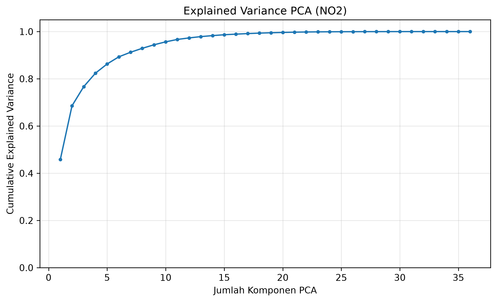

### CO

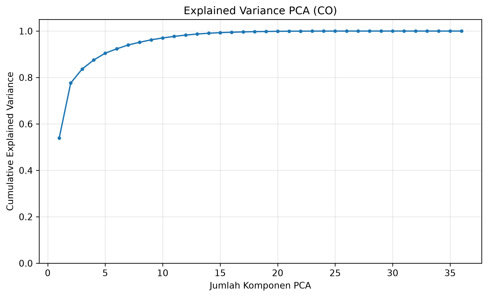

### SO₂


### 1.3.2 Cumulative Variance PCA 1–37

Cumulative variance digunakan untuk melihat akumulasi variasi data yang dapat dijelaskan oleh komponen PCA.

### Kode

```
import matplotlib.pyplot as plt

plt.figure(figsize=(10, 6))

plt.plot(
    range(1, 38),
    cumulative_variance,
    marker="o"
)

plt.xlabel("Jumlah Komponen PCA")
plt.ylabel("Cumulative Explained Variance")
plt.title("Cumulative Variance PCA 1–37")

plt.grid(True)
plt.tight_layout()
plt.show()
```

### Hasil

Pada PCA 37, cumulative variance untuk ketiga polutan mencapai **1.0**. 

### NO₂

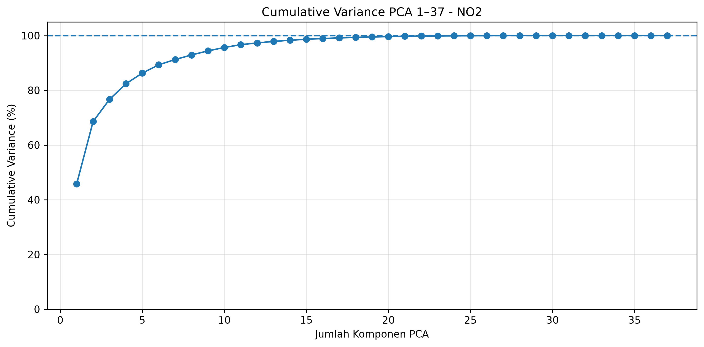

### CO

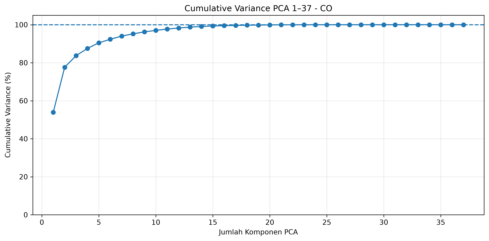

### SO₂

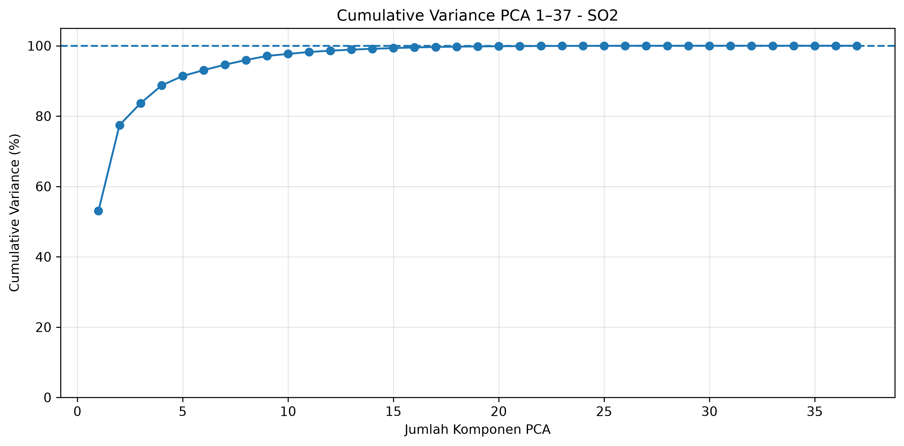


## 1.4 Implementasi K-Means

Setelah data direduksi menggunakan PCA, tahap berikutnya adalah melakukan clustering menggunakan algoritma **K-Means**.

Pada penelitian ini jumlah cluster yang diuji adalah:

```
K = 2 sampai K = 10
```

Pengujian dilakukan pada PCA 1 sampai PCA 37 sehingga setiap kombinasi PCA dan jumlah cluster dapat dibandingkan.

### Kode

```
from sklearn.cluster import KMeans

hasil = []

for n_pca in range(1, 38):

    pca = PCA(n_components=n_pca)
    X_pca = pca.fit_transform(X_scaled)

    for k in range(2, 11):

        kmeans = KMeans(
            n_clusters=k,
            random_state=42,
            n_init=10
        )

        labels = kmeans.fit_predict(X_pca)

        hasil.append({
            "PCA": n_pca,
            "K": k,
            "Inertia": kmeans.inertia_
        })
```

Parameter yang digunakan:

| ParameterNilai |      |
| -------------- | ---- |
| PCA            | 1–37 |
| K              | 2–10 |
| `random_state` | 42   |
| `n_init`       | 10   |


## 1.5 Evaluasi Jumlah Cluster Menggunakan Elbow Method

**Elbow Method** digunakan untuk melihat perubahan nilai inertia berdasarkan jumlah cluster.

Inertia merupakan jumlah kuadrat jarak data terhadap centroid cluster masing-masing.

Semakin besar jumlah cluster, nilai inertia biasanya semakin kecil. Oleh karena itu, grafik Elbow digunakan untuk melihat titik perubahan penurunan inertia.

### Kode

```
from sklearn.cluster import KMeans
import matplotlib.pyplot as plt

inertia = []

for k in range(2, 11):

    kmeans = KMeans(
        n_clusters=k,
        random_state=42,
        n_init=10
    )

    kmeans.fit(X_pca)

    inertia.append(kmeans.inertia_)

plt.figure(figsize=(8, 5))

plt.plot(
    range(2, 11),
    inertia,
    marker="o"
)

plt.xlabel("Jumlah Cluster (K)")
plt.ylabel("Inertia")
plt.title("Elbow Method")

plt.grid(True)
plt.tight_layout()
plt.show()
```


### 1.5.1 Output Terminal Elbow Method

### NO₂

```
K=2  : 1326.578705
K=3  : 1001.281921
K=4  : 811.798641
K=5  : 655.789824
K=6  : 578.312417
K=7  : 504.989692
K=8  : 458.598752
K=9  : 424.658844
K=10 : 373.027966
```

### CO

```
K=2  : 1123.800303
K=3  : 660.214101
K=4  : 509.373825
K=5  : 413.889526
K=6  : 361.351576
K=7  : 315.868398
K=8  : 272.854136
K=9  : 239.322559
K=10 : 221.039012
```

### SO₂

```
K=2  : 1210.459866
K=3  : 691.644801
K=4  : 525.289021
K=5  : 413.678733
K=6  : 335.555572
K=7  : 301.063800
K=8  : 267.415808
K=9  : 239.817616
K=10 : 230.171524
```

Nilai inertia tersebut digunakan untuk membuat grafik Elbow.


### 1.5.2 Grafik Elbow Method

### NO₂

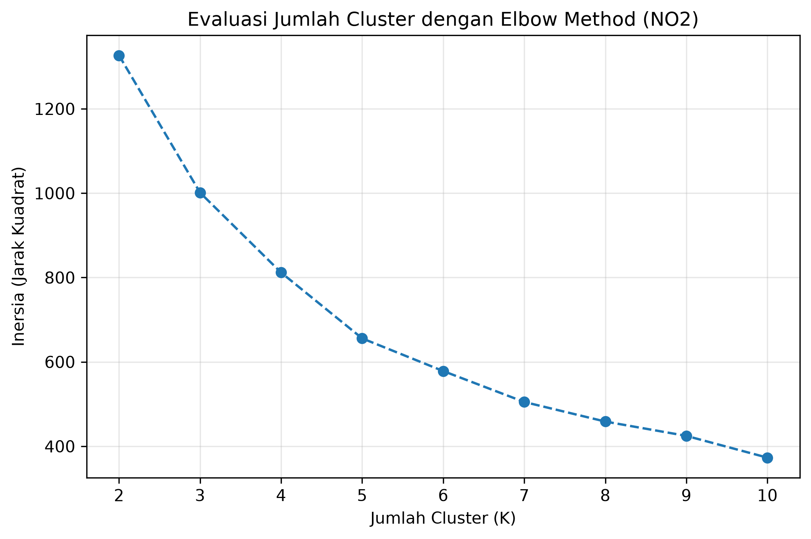

### CO

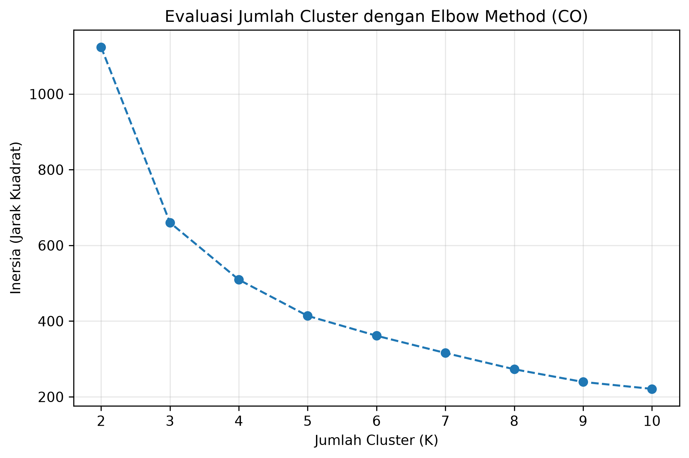

### SO₂

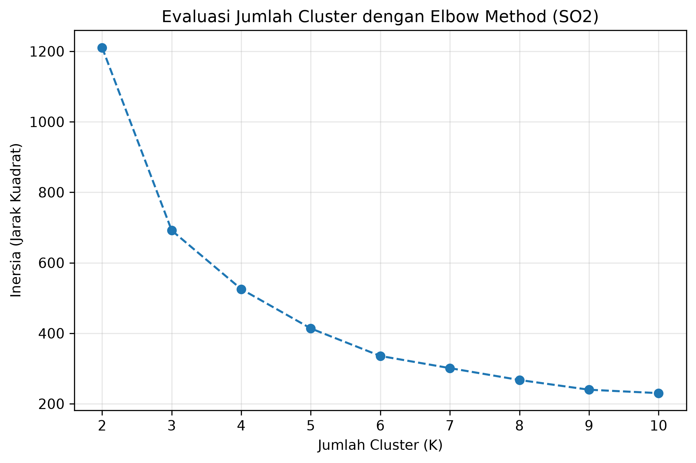

### Pembahasan

Grafik Elbow menunjukkan bahwa nilai inertia mengalami penurunan ketika jumlah cluster ditambah. Namun, Elbow Method saja tidak digunakan sebagai satu-satunya dasar untuk menentukan jumlah cluster karena penentuan struktur cluster juga perlu dilihat menggunakan metrik evaluasi lainnya.

Oleh karena itu, pada penelitian ini hasil Elbow kemudian dibandingkan dengan **Silhouette Score, Davies-Bouldin Index, dan Calinski-Harabasz Index**.


## 1.6 Evaluasi Kualitas Clustering

Selain menggunakan Elbow Method, kualitas hasil clustering dievaluasi menggunakan tiga metrik:

1.  Silhouette Score 
2.  Davies-Bouldin Index 
3.  Calinski-Harabasz Index 


### 1.6.1 Silhouette Score

Silhouette Score digunakan untuk melihat seberapa baik suatu data berada di dalam cluster dibandingkan dengan cluster lainnya.

Nilainya berada pada rentang **-1 sampai 1**.

Semakin mendekati 1, semakin baik pemisahan cluster.

### Kode

```
from sklearn.metrics import silhouette_score

silhouette = silhouette_score(
    X_pca,
    labels
)

print("Silhouette Score :", silhouette)
```


### 1.6.2 Davies-Bouldin Index

Davies-Bouldin Index digunakan untuk melihat tingkat kemiripan antar-cluster.

Pada metrik ini, nilai yang lebih kecil menunjukkan pemisahan cluster yang lebih baik.

### Kode

```
from sklearn.metrics import davies_bouldin_score

db_score = davies_bouldin_score(
    X_pca,
    labels
)

print("Davies-Bouldin Index :", db_score)
```


### 1.6.3 Calinski-Harabasz Index

Calinski-Harabasz Index digunakan untuk membandingkan penyebaran data antar-cluster dengan penyebaran data di dalam cluster.

Nilai yang lebih tinggi menunjukkan pemisahan cluster yang lebih baik.

### Kode

```
from sklearn.metrics import calinski_harabasz_score

ch_score = calinski_harabasz_score(
    X_pca,
    labels
)

print("Calinski-Harabasz Index :", ch_score)
```


## 1.7 Evaluasi PCA 1–37

Pengujian dilakukan pada:

```
PCA 1 sampai PCA 37
```

dan setiap PCA diuji menggunakan:

```
K = 2 sampai K = 10
```

Untuk setiap kombinasi dihitung:

-  Silhouette Score 
-  Davies-Bouldin Index 
-  Calinski-Harabasz Index 
-  Inertia 
-  Cumulative Variance 

### Kode

```
from sklearn.metrics import (
    silhouette_score,
    davies_bouldin_score,
    calinski_harabasz_score
)

hasil = []

for n_pca in range(1, 38):

    pca = PCA(n_components=n_pca)
    X_pca = pca.fit_transform(X_scaled)

    cumulative_variance = (
        pca.explained_variance_ratio_.sum()
    )

    for k in range(2, 11):

        kmeans = KMeans(
            n_clusters=k,
            random_state=42,
            n_init=10
        )

        labels = kmeans.fit_predict(X_pca)

        silhouette = silhouette_score(
            X_pca,
            labels
        )

        db_score = davies_bouldin_score(
            X_pca,
            labels
        )

        ch_score = calinski_harabasz_score(
            X_pca,
            labels
        )

        hasil.append({
            "PCA": n_pca,
            "K": k,
            "Cumulative_Variance": cumulative_variance,
            "Silhouette": silhouette,
            "Davies_Bouldin": db_score,
            "Calinski_Harabasz": ch_score,
            "Inertia": kmeans.inertia_
        })

hasil_df = pd.DataFrame(hasil)

hasil_df.to_csv(
    "hasil_PCA1_37_K2_10.csv",
    index=False
)
```


## 1.8 Output Terminal Implementasi PCA 1–37

Program berhasil dijalankan untuk ketiga polutan.

### Output

```
======================================================================
POLUTAN : NO2
Jumlah data : 37
Jumlah fitur : 68
Missing value : 0
Infinity : 0
Terbaik keseluruhan: PCA 1, K=2, Silhouette=0.962038, DB=0.007346, CH=8857.149772
======================================================================
POLUTAN : CO
Jumlah data : 37
Jumlah fitur : 68
Missing value : 0
Infinity : 0
Terbaik keseluruhan: PCA 1, K=2, Silhouette=0.948900, DB=0.016955, CH=1749.430762
======================================================================
POLUTAN : SO2
Jumlah data : 37
Jumlah fitur : 68
Missing value : 0
Infinity : 0
Terbaik keseluruhan: PCA 1, K=2, Silhouette=0.925296, DB=0.030963, CH=366.002229
```

Output tersebut menunjukkan bahwa proses K-Means berhasil dilakukan pada seluruh data polutan tanpa missing value maupun infinity.


## 1.9 Hasil Konfigurasi Terbaik

Berdasarkan nilai Silhouette tertinggi dari pengujian PCA 1–37 dan K 2–10, diperoleh hasil sebagai berikut. 

### NO₂

| Parameter | Nilai |
|---|---:|
| PCA | 1 |
| K | 2 |
| Cumulative Variance | 0.458151 |
| Silhouette | 0.962038 |
| Davies-Bouldin | 0.007346 |
| Calinski-Harabasz | 8857.149772 |

### CO

| Parameter | Nilai |
|---|---:|
| PCA | 1 |
| K | 2 |
| Cumulative Variance | 0.539550 |
| Silhouette | 0.948900 |
| Davies-Bouldin | 0.016955 |
| Calinski-Harabasz | 1749.430762 |

### SO₂

| Parameter | Nilai |
|---|---:|
| PCA | 1 |
| K | 2 |
| Cumulative Variance | 0.530483 |
| Silhouette | 0.925296 |
| Davies-Bouldin | 0.030963 |
| Calinski-Harabasz | 366.002229 |


## 1.10 Grafik Silhouette PCA 1–37

Untuk melihat perubahan kualitas clustering pada setiap jumlah komponen PCA, dibuat grafik Silhouette PCA 1 sampai PCA 37.

### Kode

```
import matplotlib.pyplot as plt

plt.figure(figsize=(10, 6))

plt.plot(
    summary["PCA"],
    summary["Silhouette"],
    marker="o"
)

plt.xlabel("Jumlah Komponen PCA")
plt.ylabel("Silhouette Score")
plt.title("Silhouette Score PCA 1–37")

plt.grid(True)
plt.tight_layout()
plt.show()
```

### Grafik NO₂

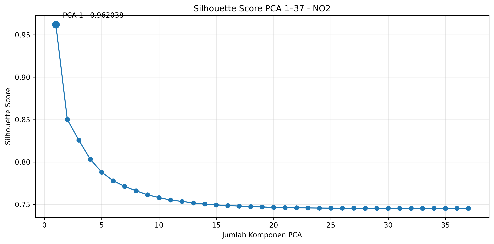

### Grafik CO

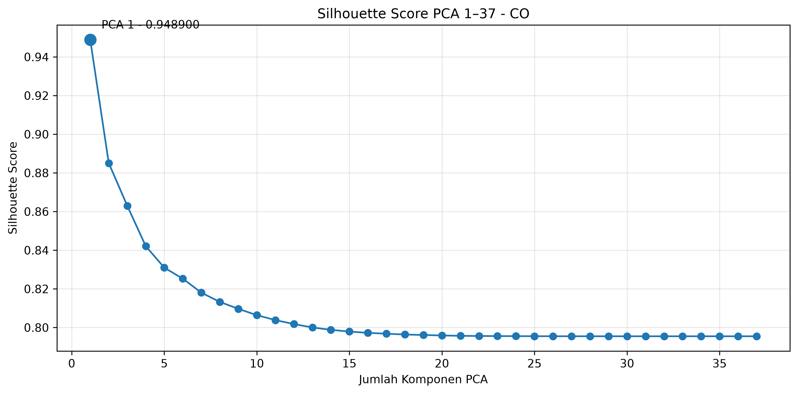

### Grafik SO₂

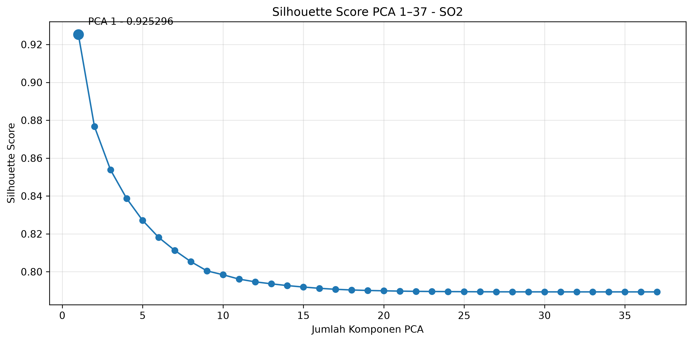

### Pembahasan

Hasil menunjukkan bahwa nilai Silhouette tertinggi untuk ketiga polutan diperoleh pada **PCA 1 dengan K=2**.

Nilai tersebut adalah:

```
NO₂ = 0.962038
CO  = 0.948900
SO₂ = 0.925296
```

Setelah jumlah komponen PCA ditambah, nilai Silhouette cenderung menurun dan kemudian menjadi lebih stabil pada jumlah komponen yang lebih tinggi. 


## 1.11 Perbandingan PCA 1 dan PCA 37

Walaupun PCA 1 menghasilkan nilai Silhouette tertinggi, sesuai dengan instruksi tugas tetap dilakukan reduksi dimensi hingga **PCA 37**.

Perbandingan hasilnya:

| Polutan | Silhouette PCA 1 | Silhouette PCA 37 |
|---|---:|---:|
| NO₂ | 0.962038 | 0.745489 |
| CO | 0.948900 | 0.795494 |
| SO₂ | 0.925296 | 0.789366 |

Pada PCA 37, cumulative variance ketiga polutan mencapai **1.0**. 

Hal ini menunjukkan bahwa PCA 37 mempertahankan seluruh variasi yang direpresentasikan oleh hasil PCA, tetapi penambahan jumlah komponen tidak otomatis membuat kualitas clustering menjadi lebih tinggi.


## 1.12 Visualisasi Scatter Plot PCA dengan K=2

Berdasarkan hasil evaluasi, konfigurasi PCA 1 dengan K=2 memiliki nilai Silhouette tertinggi pada ketiga polutan.

Visualisasi digunakan untuk melihat persebaran data hasil clustering.

### Kode

```
from sklearn.cluster import KMeans
import matplotlib.pyplot as plt

kmeans = KMeans(
    n_clusters=2,
    random_state=42,
    n_init=10
)

labels = kmeans.fit_predict(X_pca)

plt.figure(figsize=(10, 6))

plt.scatter(
    X_pca[:, 0],
    X_pca[:, 1],
    c=labels,
    s=100
)

plt.xlabel("PCA 1")
plt.ylabel("PCA 2")
plt.title("Scatter Plot Hasil K-Means K=2")

plt.grid(True)
plt.tight_layout()
plt.show()
```

### NO₂

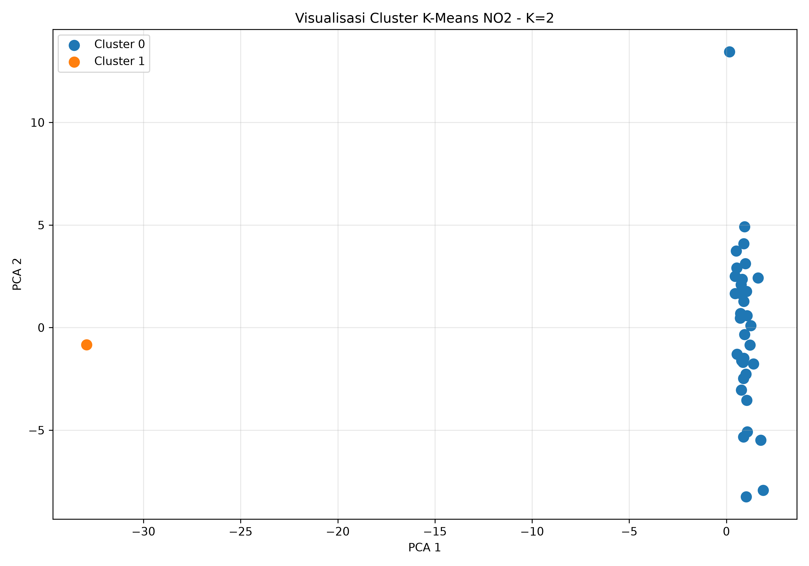

### CO

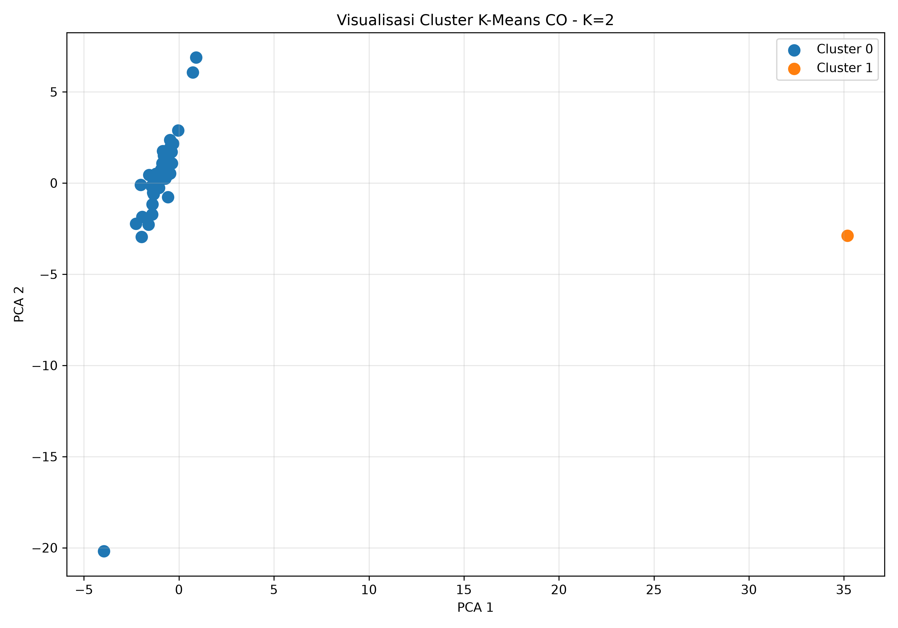

### SO₂

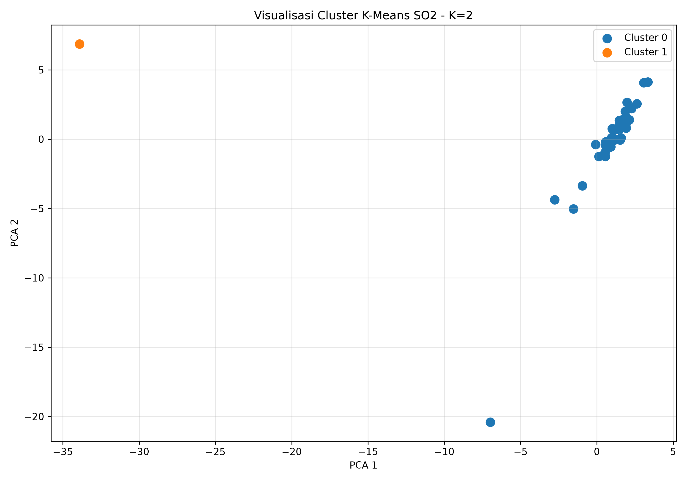

Visualisasi tersebut digunakan untuk melihat pemisahan data berdasarkan hasil clustering K=2.


## 1.13 Visualisasi Hasil Cluster

Selain visualisasi berdasarkan PCA, hasil clustering juga divisualisasikan berdasarkan cluster yang digunakan pada tahap profiling.

File gambar hasil visualisasi yang tersedia:

### NO₂

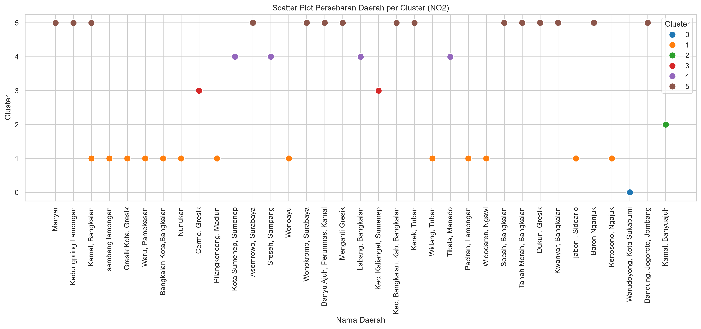

### CO

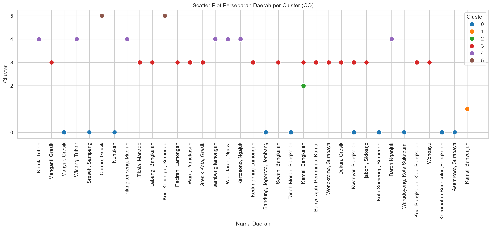

### SO₂

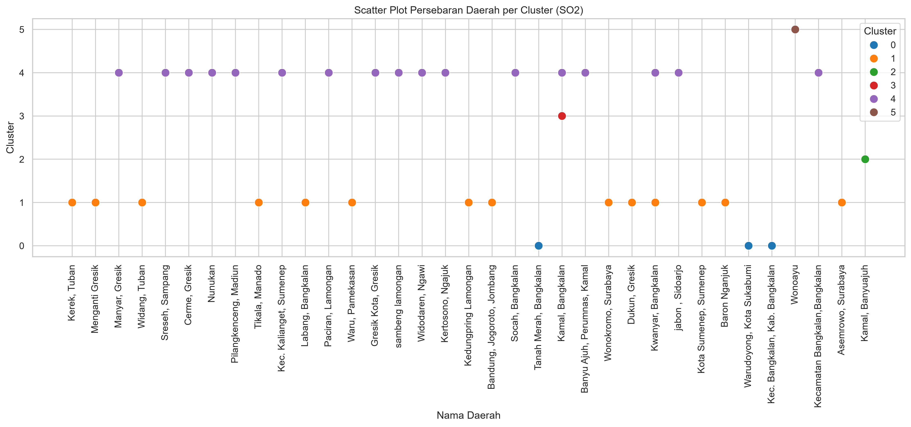

Gambar tersebut digunakan sebagai bukti visual hasil pembagian data ke dalam cluster.

**Catatan:** nama file pada repository digunakan apa adanya. Jumlah K yang digunakan dalam visualisasi harus mengikuti konfigurasi pada script yang menghasilkan gambar tersebut, bukan hanya berdasarkan nama file.


## 1.14 Visualisasi Cluster Berdasarkan Daerah

Untuk melihat persebaran hasil clustering berdasarkan daerah, digunakan scatter plot dengan informasi daerah dan cluster.

### NO₂

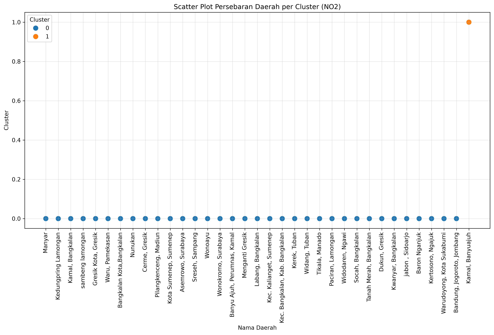

### CO

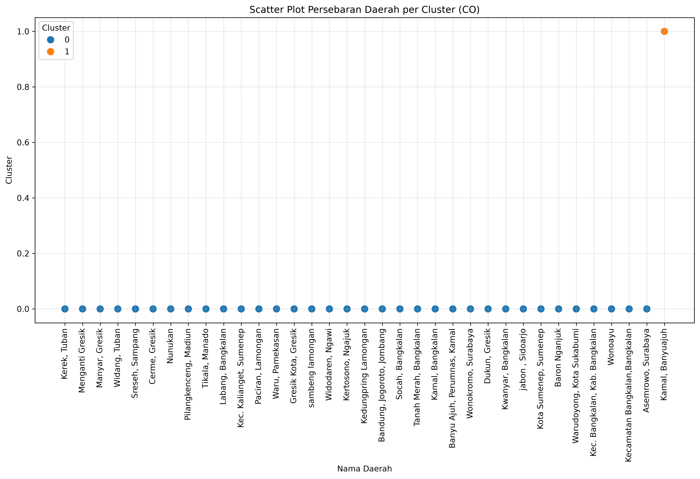

### SO₂


Visualisasi ini membantu melihat apakah data dari daerah tertentu berada pada cluster yang sama atau tersebar pada beberapa cluster.


## 1.15 Scatter Plot PCA

Selain scatter plot hasil K-Means, tersedia juga visualisasi PCA untuk melihat persebaran data pada ruang hasil reduksi dimensi.

### NO₂

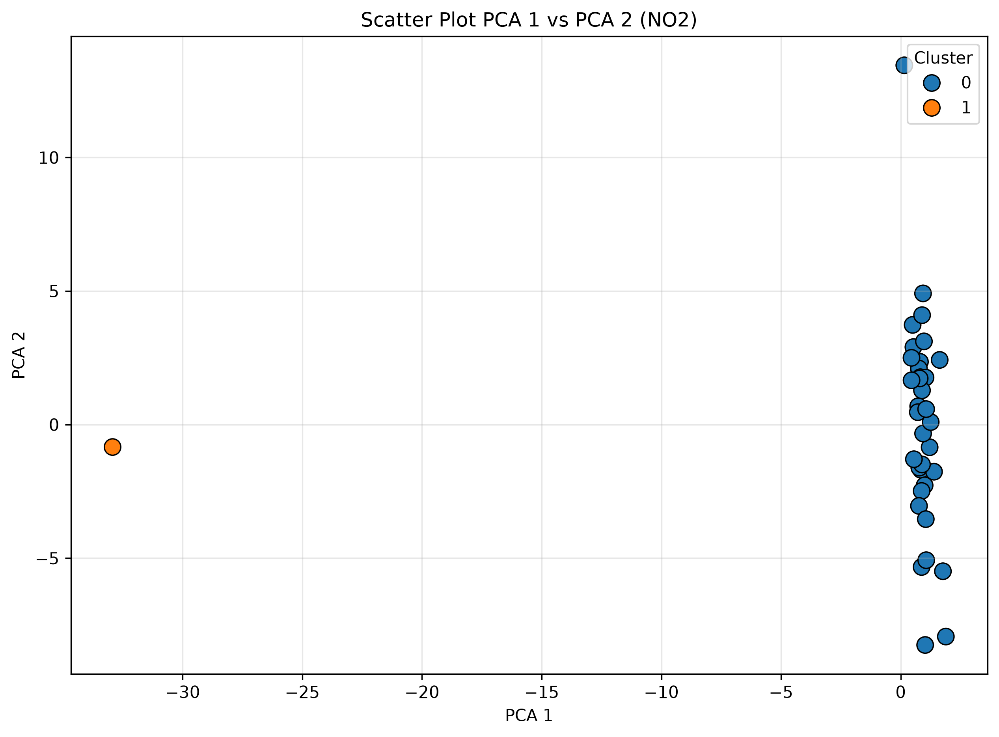

### CO

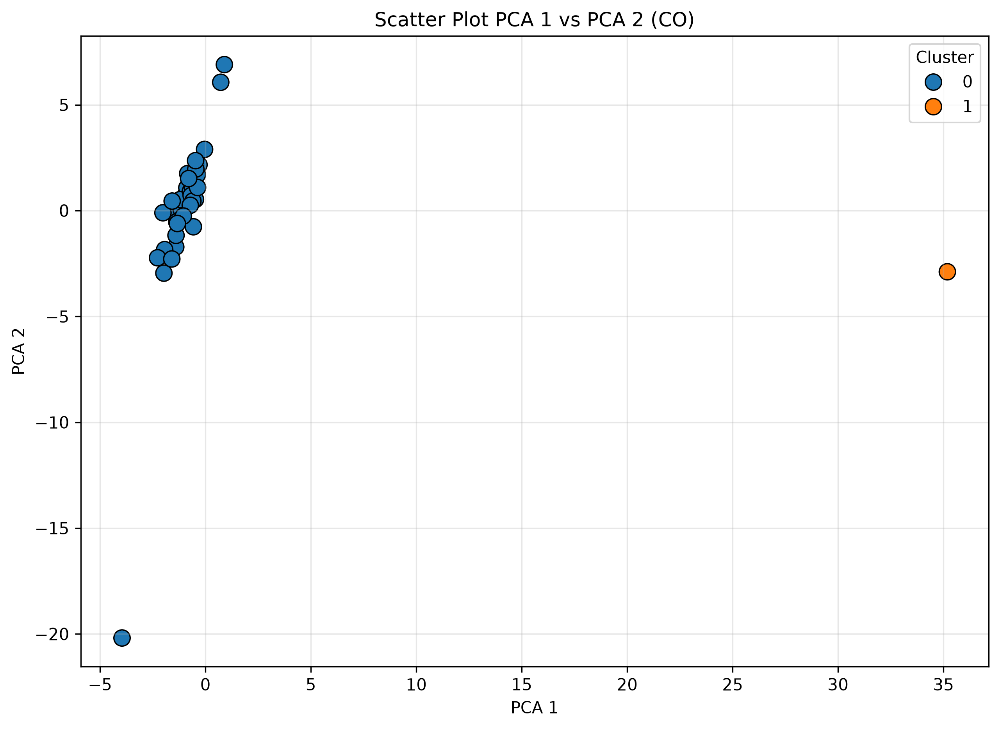

### SO₂

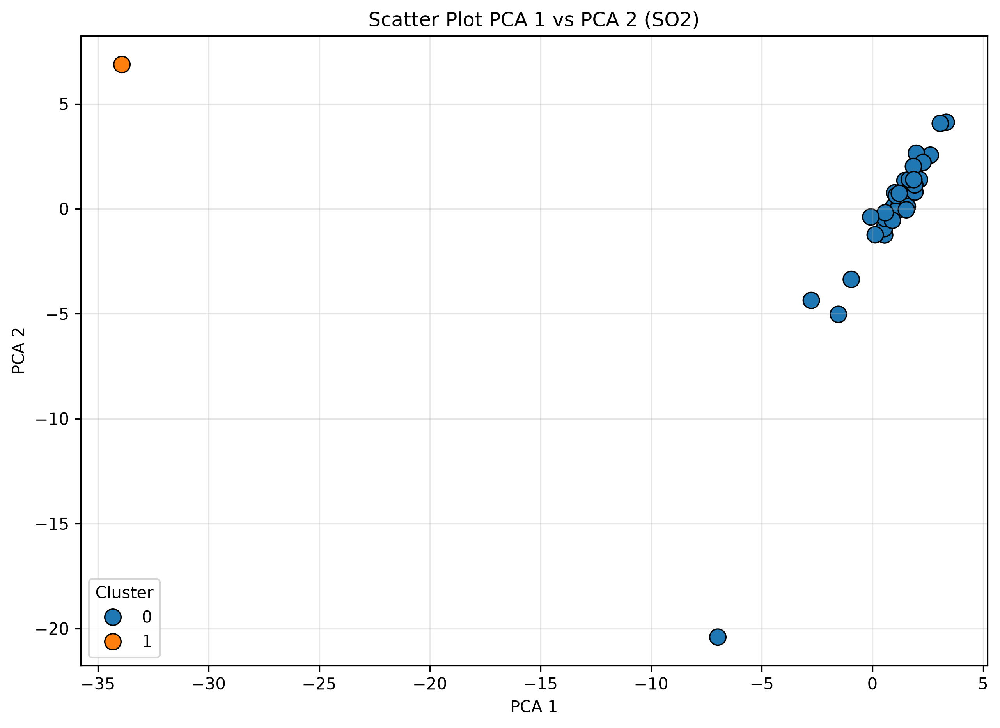

Visualisasi ini digunakan sebagai tambahan untuk melihat struktur persebaran data setelah dilakukan reduksi dimensi.


## 1.16 Ringkasan Hasil Clustering

Hasil keseluruhan implementasi Python dapat dirangkum sebagai berikut:

| Polutan | Data | Fitur | PCA Terbaik | K | Silhouette |
|---|---:|---:|---:|---:|---:|
| NO₂ | 37 | 68 | 1 | 2 | 0.962038 |
| CO | 37 | 68 | 1 | 2 | 0.948900 |
| SO₂ | 37 | 68 | 1 | 2 | 0.925296 |

Berdasarkan hasil tersebut, ketiga polutan memiliki konfigurasi dengan Silhouette tertinggi pada **PCA 1 dan K=2**. 

Namun, hasil tersebut tidak berarti PCA 37 tidak digunakan. PCA 37 tetap dilakukan karena merupakan bagian dari instruksi tugas dan digunakan untuk melihat perubahan kualitas clustering pada berbagai jumlah komponen PCA.


## 1.17 Pembahasan

Berdasarkan seluruh proses yang telah dilakukan, data awal yang terdiri dari **68 fitur TSFEL** berhasil diproses menggunakan StandardScaler, PCA, dan K-Means.

Pengujian dilakukan secara bertahap dengan PCA 1 sampai PCA 37 dan jumlah cluster K=2 sampai K=10. Untuk mengetahui kualitas hasil clustering digunakan Silhouette Score, Davies-Bouldin Index, Calinski-Harabasz Index, dan Inertia.

Hasil pengujian menunjukkan bahwa konfigurasi dengan nilai Silhouette tertinggi pada ketiga polutan berada pada **PCA 1 dengan K=2**.

NO₂ menghasilkan Silhouette sebesar **0.962038**, CO sebesar **0.948900**, dan SO₂ sebesar **0.925296**. 

Sementara itu, ketika menggunakan PCA 37, nilai Silhouette menjadi **0.745489 untuk NO₂, 0.795494 untuk CO, dan 0.789366 untuk SO₂**. Meskipun nilai Silhouette menurun, cumulative variance pada PCA 37 mencapai **1.0** untuk ketiga polutan. 

Hasil ini menunjukkan bahwa semakin banyak komponen PCA yang digunakan tidak selalu menghasilkan pemisahan cluster yang lebih baik. PCA digunakan untuk merepresentasikan data dalam dimensi yang lebih rendah, sedangkan kualitas hasil clustering tetap perlu dievaluasi menggunakan metrik clustering.

Elbow Method juga digunakan untuk melihat perubahan inertia pada K=2 sampai K=10. Hasil Elbow dapat digunakan sebagai salah satu bahan pertimbangan dalam menentukan jumlah cluster, tetapi tidak digunakan sendirian karena struktur cluster juga perlu dilihat menggunakan metrik lainnya.

Scatter Plot kemudian digunakan untuk melihat persebaran data hasil clustering secara visual. Dengan adanya visualisasi tersebut, hasil pengelompokan data dapat lebih mudah diamati dan dibandingkan.


## 1.18 Kesimpulan

Berdasarkan implementasi K-Means menggunakan Python dan Scikit-Learn, dapat disimpulkan bahwa:

1.  Data yang digunakan terdiri dari **37 data dengan 68 fitur TSFEL** untuk masing-masing polutan. 
2.  Data telah diperiksa dan tidak memiliki missing value maupun infinity. 
3.  StandardScaler digunakan untuk menyamakan skala antar fitur sebelum dilakukan PCA. 
4.  PCA digunakan untuk melakukan reduksi dimensi dari 68 fitur menjadi **PCA 1 sampai PCA 37**. 
5.  K-Means diuji menggunakan jumlah cluster **K=2 sampai K=10**. 
6.  Elbow Method digunakan untuk melihat perubahan nilai inertia terhadap jumlah cluster. 
7.  Kualitas clustering dievaluasi menggunakan **Silhouette Score, Davies-Bouldin Index, dan Calinski-Harabasz Index**. 
8.  Berdasarkan Silhouette tertinggi, konfigurasi yang diperoleh adalah: 
   -  NO₂: PCA 1, K=2, Silhouette **0.962038** 
   -  CO: PCA 1, K=2, Silhouette **0.948900** 
   -  SO₂: PCA 1, K=2, Silhouette **0.925296**.  
9.  Pada PCA 37, cumulative variance ketiga polutan mencapai **1.0**.  
10.  Penambahan jumlah komponen PCA tidak selalu meningkatkan kualitas clustering. 
11.  Elbow Method dan Scatter Plot digunakan sebagai pendukung untuk melihat struktur dan persebaran hasil clustering. 
12.  Hasil implementasi Python ini selanjutnya dapat dibandingkan dengan proses clustering menggunakan **KNIME**.