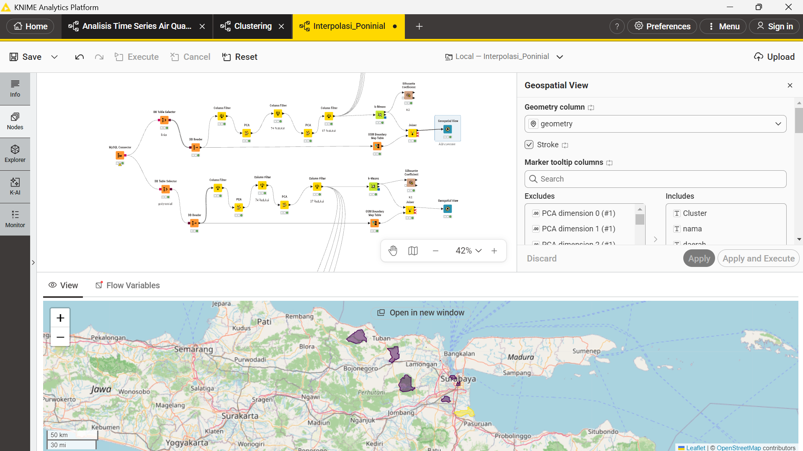

# Clustering Kualitas Udara dengan K-Means

## 1. Pendahuluan

Tahap ini merupakan proses segmentasi data kualitas udara menggunakan
algoritma **K-Means Clustering**. Data yang digunakan berasal dari hasil
ekstraksi fitur TSFEL pada tiga polutan, yaitu **NO₂, CO, dan SO₂**.

Sebelum dilakukan clustering, jumlah fitur direduksi menggunakan
**Principal Component Analysis (PCA)** agar data dengan dimensi tinggi
dapat diproses dengan lebih efektif.

Proses pengolahan dilakukan menggunakan **KNIME**, dan hasil akhirnya
divisualisasikan dalam bentuk peta spasial menggunakan **Geospatial
View**.

## 2. Pembentukan Fitur

Terdapat tiga jenis polutan yang digunakan dalam proses analisis:

-   NO₂
-   CO
-   SO₂

Masing-masing polutan menghasilkan **68 fitur TSFEL**. Oleh karena itu,
jumlah fitur keseluruhan yang digunakan dalam proses clustering adalah:

$$
3 \\times 68 = 204
$$

Dengan demikian, data awal memiliki **204 dimensi**. Fitur-fitur
tersebut kemudian digunakan sebagai dasar untuk melakukan reduksi
dimensi dan proses clustering.

## 3. Reduksi Dimensi dengan PCA

Data dengan 204 dimensi memiliki jumlah fitur yang cukup besar sehingga
dilakukan reduksi dimensi menggunakan **Principal Component Analysis
(PCA)**.

Reduksi dilakukan secara bertahap:

$$
204 \\rightarrow 74 \\rightarrow 37
$$

Tahapan tersebut dilakukan dengan dua proses PCA.

### Tahap pertama

Data dengan jumlah awal **204 fitur** direduksi menjadi **74 komponen
utama**.

### Tahap kedua

Hasil 74 komponen tersebut kemudian direduksi kembali menjadi **37
komponen utama**.

Hasil akhir dari proses reduksi adalah data berdimensi **37**, yang
selanjutnya digunakan sebagai input untuk algoritma K-Means.

## 4. Proses Clustering K-Means

Setelah proses PCA selesai, data hasil reduksi digunakan untuk melakukan
clustering menggunakan algoritma **K-Means**.

Eksperimen dilakukan dengan beberapa jumlah cluster, yaitu:

-   k = 2
-   k = 3
-   k = 4
-   k = 5
-   k = 6

Pengujian dilakukan pada dua pendekatan fitur:

1.  **Linear**
2.  **Polynomial**

Tujuan pengujian beberapa nilai k adalah untuk menentukan jumlah cluster
yang memberikan hasil segmentasi terbaik.

## 5. Evaluasi dengan Silhouette Coefficient

Kualitas hasil clustering dievaluasi menggunakan **Silhouette
Coefficient**.

Nilai Silhouette digunakan untuk melihat seberapa baik suatu objek
berada di dalam cluster-nya dibandingkan dengan cluster lainnya. Semakin
tinggi nilai Silhouette, semakin baik pemisahan antar-cluster yang
dihasilkan.

### Hasil pengujian pendekatan Linear

  Pendekatan     k   Silhouette
  ------------ --- ------------
  Linear         2    **0.822**
  Linear         3        0.647
  Linear         4        0.659
  Linear         5        0.637
  Linear         6        0.575

### Hasil pengujian pendekatan Polynomial

  Pendekatan     k   Silhouette
  ------------ --- ------------
  Polynomial     2        0.634
  Polynomial     3        0.471
  Polynomial     4        0.466
  Polynomial     5        0.486
  Polynomial     6        0.554

## 6. Perbandingan Hasil Clustering

Berdasarkan seluruh percobaan, nilai Silhouette tertinggi diperoleh pada
pendekatan **Linear dengan k = 2**, yaitu:

$$
\\text{Silhouette} = 0.822
$$

Nilai tersebut merupakan nilai tertinggi dibandingkan seluruh
konfigurasi Linear dan Polynomial yang diuji.

Dengan demikian, konfigurasi yang dipilih sebagai hasil clustering
terbaik adalah:

  Parameter                Hasil
  ------------------------ -----------
  Pendekatan               Linear
  Jumlah cluster           k = 2
  Silhouette Coefficient   **0.822**

Konfigurasi **Linear dengan k = 2** kemudian digunakan untuk
menghasilkan clustering akhir.

## 7. Workflow Pengolahan di KNIME

Seluruh proses pengolahan dilakukan menggunakan KNIME. Workflow mencakup
proses pembacaan data, pemilihan fitur, reduksi dimensi menggunakan PCA,
proses K-Means, evaluasi menggunakan Silhouette Coefficient, serta
penggabungan hasil clustering dengan data spasial.

Alur utama pengolahan adalah:

``` text
Data Polutan
    ↓
Ekstraksi 68 Fitur per Polutan
    ↓
204 Fitur
    ↓
PCA
    ↓
74 Dimensi
    ↓
PCA
    ↓
37 Dimensi
    ↓
K-Means
    ↓
Silhouette Coefficient
    ↓
Pemilihan Model Terbaik
    ↓
Join dengan Data Spasial
    ↓
Geospatial View
```

Workflow yang digunakan dalam proses pengolahan ditampilkan pada gambar
berikut.



## 8. Pembuatan Peta Clustering

Setelah konfigurasi terbaik diperoleh, hasil cluster dari **Linear
dengan k = 2** digunakan untuk membuat visualisasi spasial.

Hasil clustering kemudian digabungkan dengan data batas wilayah sehingga
setiap wilayah memiliki informasi cluster. Data tersebut kemudian
ditampilkan menggunakan **Geospatial View** pada KNIME.

Pada visualisasi peta, informasi yang digunakan antara lain:

-   `nama`
-   `daerah`
-   `Cluster`
-   `geometry`

Informasi `nama`, `daerah`, dan `Cluster` juga digunakan sebagai
informasi pada tooltip atau popup ketika wilayah pada peta dipilih.

## 9. Hasil Clustering Spasial

Hasil akhir clustering ditampilkan dalam bentuk peta spasial. Peta ini
menunjukkan pembagian wilayah berdasarkan hasil clustering kualitas
udara.


Peta tersebut merupakan hasil dari konfigurasi clustering terbaik, yaitu
**pendekatan Linear dengan k = 2 dan nilai Silhouette 0.822**.

## 10. Analisis Hasil

Berdasarkan hasil pengujian, pendekatan Linear memberikan hasil
clustering yang lebih baik dibandingkan pendekatan Polynomial.

Pada pendekatan Linear, nilai Silhouette tertinggi diperoleh ketika
jumlah cluster adalah **2**, yaitu sebesar **0.822**. Sementara itu,
pada pendekatan Polynomial, nilai Silhouette tertinggi juga diperoleh
pada **k = 2**, yaitu **0.634**.

Perbandingan tersebut menunjukkan bahwa konfigurasi Linear dengan dua
cluster memberikan pemisahan kelompok yang paling baik dari seluruh
konfigurasi yang diuji.

Oleh karena itu, hasil **Linear k = 2** dipilih sebagai clustering akhir
dan digunakan dalam proses visualisasi spasial.

## 11. Kesimpulan

Berdasarkan proses pengolahan yang telah dilakukan, dapat disimpulkan
bahwa:

1.  Tiga polutan, yaitu **NO₂, CO, dan SO₂**, menghasilkan total **204
    fitur TSFEL**.
2.  Data 204 dimensi direduksi secara bertahap menggunakan PCA menjadi
    **74 dimensi**, kemudian menjadi **37 dimensi**.
3.  Clustering dilakukan menggunakan algoritma **K-Means** dengan
    pengujian jumlah cluster **k = 2 sampai k = 6**.
4.  Pengujian dilakukan pada pendekatan **Linear** dan **Polynomial**.
5.  Hasil terbaik diperoleh pada pendekatan **Linear dengan k = 2**.
6.  Nilai Silhouette terbaik yang diperoleh adalah **0.822**.
7.  Hasil clustering terbaik kemudian digunakan untuk membuat **peta
    spasial menggunakan Geospatial View di KNIME**.
8.  Peta tersebut menjadi visualisasi akhir dari segmentasi kualitas
    udara berdasarkan hasil clustering.
