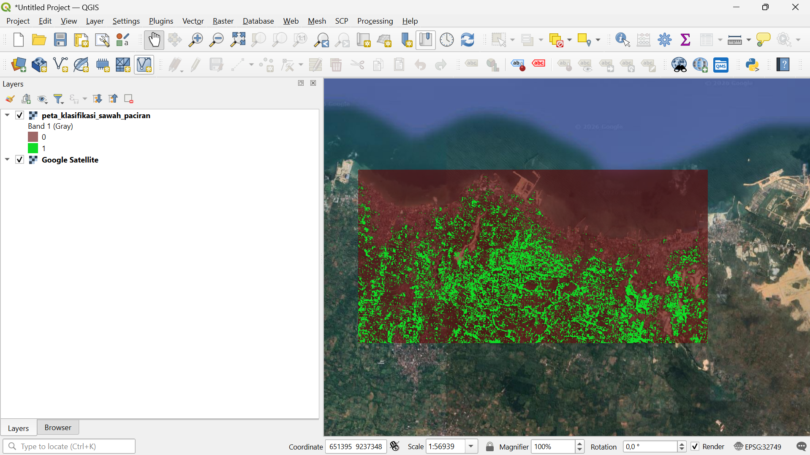

# Klasifikasi Tutupan Lahan Sawah dengan Sentinel-2A

## 1. Pendahuluan

Materi ini membahas proses klasifikasi tutupan lahan sawah menggunakan citra satelit **Sentinel-2A** dan metode **Random Forest**.

Klasifikasi dilakukan pada wilayah **Kecamatan Paciran, Kabupaten Lamongan, Jawa Timur**. Tutupan lahan dibagi menjadi dua kelas, yaitu:

- **Sawah**
- **Non-Sawah**

Proses pengolahan meliputi akuisisi citra, preprocessing, pembuatan data ground truth, ekstraksi nilai pixel, pelatihan Random Forest, evaluasi model, hingga pembuatan peta klasifikasi dalam format GeoTIFF.

---

## 2. Akuisisi Citra Sentinel-2A

Data citra yang digunakan adalah **Sentinel-2A MSI Level-2A (L2A)**. Produk Level-2A digunakan karena menyediakan data reflektansi permukaan atau **Bottom-of-Atmosphere (BOA) reflectance**.

Pengambilan citra dilakukan menggunakan Python dengan memanfaatkan katalog **Microsoft Planetary Computer**.

Area penelitian ditentukan menggunakan bounding box:

```text
[112.335, -6.895, 112.400, -6.863]
````

Pencarian citra utama dilakukan pada periode:

```
1 Juli 2023 – 30 September 2023
```

dengan kriteria tutupan awan:

```
< 15%
```

Apabila citra dengan kriteria tersebut tidak ditemukan, kode menyediakan pencarian alternatif pada periode:

```
1 Mei 2024 – 30 September 2024
```

dengan kriteria tutupan awan:

```
< 20%
```

Dari hasil pencarian, citra dengan nilai tutupan awan paling rendah dipilih sebagai citra yang digunakan.

---

## 3. Band yang Digunakan

Empat band Sentinel-2A digunakan dalam proses klasifikasi, yaitu:

| Band | Nama  | Panjang Gelombang | Resolusi |
| ---- | ----- | ----------------- | -------- |
| B02  | Blue  | 490 nm            | 10 m     |
| B03  | Green | 560 nm            | 10 m     |
| B04  | Red   | 665 nm            | 10 m     |
| B08  | NIR   | 842 nm            | 10 m     |

Keempat band tersebut dipilih karena menyediakan informasi spektral yang digunakan sebagai fitur dalam proses klasifikasi.

Setiap band kemudian dipotong berdasarkan area penelitian dan digabungkan menjadi satu raster komposit:

```
sentinel2_paciran_composite.tif
```

Urutan band pada raster komposit adalah:

```
B02, B03, B04, B08
```

---

## 4. Pembuatan Ground Truth

Data ground truth digunakan sebagai data referensi untuk melatih model klasifikasi.

Data dibuat dalam bentuk polygon dan memiliki atribut `id_kelas`.

Dua kelas yang digunakan adalah:

| Nilai `id_kelas` | Kelas     |
| ---------------- | --------- |
| 0                | Non-Sawah |
| 1                | Sawah     |

Jumlah polygon ground truth yang digunakan adalah **100 polygon**, dengan distribusi:

- 50 polygon Sawah 
- 50 polygon Non-Sawah 

### Kelas Sawah

Kelas Sawah mencakup area persawahan yang menunjukkan vegetasi hijau dan area pertanian yang sedang ditanami atau dalam fase pertumbuhan.

### Kelas Non-Sawah

Kelas Non-Sawah mencakup objek yang bukan merupakan persawahan, seperti:

- permukiman atau atap bangunan, 
- jalan, 
- perairan laut, 
- tambak pesisir, 
- tanah terbuka, 
- dan objek non-sawah lainnya. 

---

## 5. Penyesuaian Sistem Koordinat

Data polygon ground truth disesuaikan dengan sistem koordinat raster Sentinel-2A.

Dalam proses Python, sistem koordinat raster dibaca terlebih dahulu, kemudian polygon ground truth diubah menggunakan:

```
gdf_samples = gdf_samples.to_crs(raster_crs)
```

Langkah ini dilakukan agar posisi polygon sesuai dengan posisi pixel pada raster yang digunakan dalam proses ekstraksi.

---

## 6. Ekstraksi Nilai Pixel

Setelah polygon ground truth disesuaikan dengan raster, dilakukan ekstraksi nilai pixel dari setiap polygon.

Empat band digunakan sebagai fitur:

```
B02
B03
B04
B08
```

Pixel yang memiliki nilai valid kemudian dikumpulkan menjadi dataset fitur `X`, sedangkan `id_kelas` digunakan sebagai label `y`.

Hasil ekstraksi menghasilkan:

**8.512 pixel**

dengan distribusi:

| Kelas     | Jumlah Pixel |
| --------- | ------------ |
| Sawah     | 339          |
| Non-Sawah | 8.173        |
| **Total** | **8.512**    |

Dengan empat band sebagai fitur, bentuk dataset adalah:

```
X = 8512 × 4
```

sedangkan label memiliki bentuk:

```
y = 8512 × 1
```

---

## 7. Pembagian Data Training dan Testing

Dataset kemudian dibagi menjadi data training dan data testing.

Pembagian yang digunakan adalah:

- **70% data training** 
- **30% data testing** 

Pembagian dilakukan secara **stratified** sehingga distribusi kelas tetap dipertahankan.

Parameter yang digunakan:

```
test_size=0.3
random_state=42
stratify=y
```

Jumlah data testing yang diperoleh adalah:

**2.554 pixel**

---

## 8. Pembangunan Model Random Forest

Algoritma yang digunakan untuk klasifikasi adalah **Random Forest Classifier**.

Model dibangun menggunakan konfigurasi:

```
RandomForestClassifier(
    n_estimators=100,
    random_state=42
)
```

Parameter tersebut berarti model menggunakan **100 decision tree**.

Model kemudian dilatih menggunakan data training:

```
rf_model.fit(X_train, y_train)
```

Setelah proses training selesai, model digunakan untuk memprediksi data testing.

```
y_pred = rf_model.predict(X_test)
```

---

## 9. Evaluasi Model

Evaluasi dilakukan menggunakan **confusion matrix** dan **classification report**.

Confusion matrix yang diperoleh adalah:

| Aktual / Prediksi | Non-Sawah | Sawah |
| ----------------- | --------- | ----- |
| Non-Sawah         | 2436      | 16    |
| Sawah             | 55        | 47    |

Berdasarkan hasil tersebut, model menghasilkan akurasi keseluruhan sekitar:

**97,2%**

atau dibulatkan menjadi sekitar **97%**.

---

## 10. Classification Report

Hasil evaluasi untuk masing-masing kelas adalah:

| Kelas     | Precision | Recall | F1-Score |
| --------- | --------- | ------ | -------- |
| Non-Sawah | 0.98      | 0.99   | 0.99     |
| Sawah     | 0.75      | 0.46   | 0.57     |

### Non-Sawah

Kelas Non-Sawah menghasilkan:

- Precision = **0.98** 
- Recall = **0.99** 
- F1-Score = **0.99** 

Hasil tersebut menunjukkan bahwa model memiliki kemampuan yang sangat baik dalam mengenali pixel Non-Sawah.

### Sawah

Kelas Sawah menghasilkan:

- Precision = **0.75** 
- Recall = **0.46** 
- F1-Score = **0.57** 

Nilai recall kelas Sawah yang lebih rendah menunjukkan bahwa masih terdapat pixel Sawah yang diprediksi sebagai Non-Sawah.

---

## 11. Penerapan Model pada Seluruh Citra

Setelah model Random Forest selesai dilatih dan dievaluasi, model diterapkan pada seluruh pixel citra Sentinel-2A.

Raster dengan empat band diubah menjadi bentuk matriks pixel sehingga setiap pixel memiliki empat fitur:

```
B02, B03, B04, B08
```

Seluruh pixel kemudian diprediksi menggunakan model:

```
classified_pixels = rf_model.predict(reshaped_image)
```

Hasil prediksi dikembalikan ke bentuk raster sehingga membentuk peta klasifikasi.

---

## 12. Penyimpanan Hasil Klasifikasi

Hasil klasifikasi disimpan dalam format **GeoTIFF** dengan nama:

```
peta_klasifikasi_sawah_paciran.tif
```

Raster hasil klasifikasi menggunakan:

| Nilai | Kelas     |
| ----- | --------- |
| 0     | Non-Sawah |
| 1     | Sawah     |

Nilai hasil klasifikasi berada pada rentang **0 sampai 1**, sesuai dengan dua kelas yang digunakan dalam model.

---

## 13. Visualisasi Hasil di QGIS

Hasil GeoTIFF kemudian divisualisasikan menggunakan **QGIS**.

Peta klasifikasi ditampilkan bersama citra **Google Satellite** untuk melakukan pemeriksaan visual terhadap hasil klasifikasi.

Visualisasi menggunakan dua kelas:

- **0 — Non-Sawah** 
- **1 — Sawah** 

Hasil visualisasi digunakan untuk melihat kesesuaian spasial antara hasil klasifikasi dengan kondisi permukaan yang terlihat pada citra satelit.

### Gambar Hasil Klasifikasi



### Gambar Hasil Klasifikasi

---

## 14. Analisis Hasil

Berdasarkan evaluasi model, Random Forest menghasilkan akurasi keseluruhan sebesar **97,2%**.

Namun, performa model berbeda antara kelas Non-Sawah dan Sawah.

Kelas Non-Sawah memiliki nilai precision, recall, dan F1-score yang tinggi. Sebaliknya, kelas Sawah memiliki recall sebesar **0.46**, yang menunjukkan bahwa sebagian pixel Sawah masih diklasifikasikan sebagai Non-Sawah.

Hal tersebut menunjukkan bahwa nilai akurasi keseluruhan yang tinggi perlu dilihat bersama metrik per kelas, terutama karena jumlah pixel Non-Sawah jauh lebih besar dibandingkan jumlah pixel Sawah.

---

## 15. Hasil Akhir

Hasil akhir dari proses klasifikasi adalah raster:

```
peta_klasifikasi_sawah_paciran.tif
```

Raster tersebut berisi hasil prediksi kelas Sawah dan Non-Sawah untuk seluruh pixel pada area penelitian.

Hasil klasifikasi kemudian ditampilkan pada QGIS untuk melihat distribusi spasial kedua kelas.

## 16. Kesimpulan

Berdasarkan proses yang telah dilakukan, dapat disimpulkan bahwa:

1. Citra **Sentinel-2A Level-2A** digunakan sebagai sumber data klasifikasi.
2. Empat band dengan resolusi 10 meter digunakan sebagai fitur, yaitu **B02, B03, B04, dan B08**.
3. Ground truth terdiri dari **100 polygon**, yaitu 50 Sawah dan 50 Non-Sawah.
4. Ekstraksi menghasilkan **8.512 pixel**, terdiri dari 339 pixel Sawah dan 8.173 pixel Non-Sawah.
5. Data dibagi menjadi 70% training dan 30% testing secara stratified.
6. Model yang digunakan adalah **Random Forest dengan 100 tree dan `random_state=42`**.
7. Model menghasilkan akurasi keseluruhan sebesar **97,2%**.
8. Kelas Non-Sawah memiliki performa klasifikasi lebih baik dibandingkan kelas Sawah.
9. Model diterapkan pada seluruh pixel citra untuk menghasilkan peta klasifikasi.
10. Hasil akhir disimpan sebagai **`peta_klasifikasi_sawah_paciran.tif`** dan divisualisasikan menggunakan QGIS.
